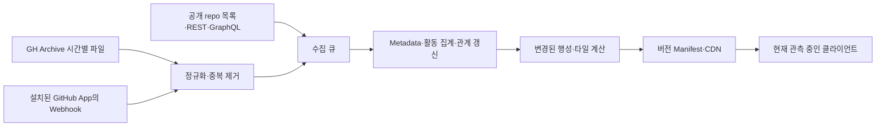

> **원본 기획안** — GPT Astra로 작성 (2026-09-25 기준). 원문 그대로 보존합니다.
> 이후 내려진 결정과 수정은 [DIRECTION.md](DIRECTION.md)가 우선하고, 지금 만드는 범위는 [PROTOTYPE_SPEC.md](PROTOTYPE_SPEC.md)가 정의합니다.

# Open-source Galaxy — 기획안

이 프로젝트의 핵심은 **"내 repository에 행성 모양을 입힌다"가 아니라, "내가 만든 것이 거대한 생태계 안에서 어떤 장소를 차지하는지 발견한다"**여야 합니다.

그래서 세 가지를 먼저 결정하겠습니다.

- 행성의 아름다움은 인기도에 비례하지 않습니다. 인기는 멀리서 보이는 존재감에 영향을 주고, 개성은 별도로 설계합니다.
- 우주의 지리는 관계로 만들되, 한번 정한 주소는 유지합니다. 변화하는 관계는 항로와 별자리로 드러냅니다.
- 착륙의 목적은 다음 여행지를 발견하는 것입니다. 표면에 내려왔는데 할 일이 없다면, 착륙은 비싼 카메라 애니메이션에 불과합니다.

> 아래는 구현 코드가 아닌 기획안입니다. API 관련 사실은 2026년 9월 25일 확인한 공식 문서를 기준으로 하며, 성능·용량·전환율 수치는 검증해야 할 설계 목표입니다.

---

## A. CORE FANTASY

나는 끝을 가늠할 수 없는 오픈소스 우주를 여행하다가, 그 안에 이미 자리 잡고 있던 나의 작은 세계를 발견한다. 그 세계의 하늘에서 내가 의지한 프로젝트와 아직 몰랐던 이웃들을 알아보고, 다음 목적지를 스스로 선택한다. 내가 만든 것은 작을 수 있지만, 이 우주에서 대체할 수 없는 하나의 장소다.

---

## B. WHY A GALAXY

Galaxy가 필요한 이유는 전체를 소유하거나 이해할 수 없지만, 그 안에서 방향을 익히고 자기 자리를 기억할 수 있는 공간이기 때문입니다.

리스트는 프로젝트를 비교하게 합니다. 이 세계는 프로젝트 사이의 관계를 이동 경로와 장소 기억으로 바꿉니다.

| GitHub의 실제 특징 | 우주에서의 대응 | 경험상 필요한 이유 |
|---|---|---|
| 한 사람이 전부 파악하기 어려운 규모 | 끝을 볼 수 없는 원경과 여러 관측 배율 | 탐험하지 않은 세계가 항상 남아 있다는 감각 |
| 독립된 repository | 각자의 이름·주소·역사를 가진 행성 | 작은 프로젝트도 독립적인 존재로 취급 |
| 프로젝트 간 기술적 관계 | 가까운 이웃과 먼 곳으로 이어지는 항로 | 관계를 읽는 대신 따라가며 이해 |
| 여러 분야에 걸친 community | 경계가 겹치는 성단과 별자리 | React Three Fiber처럼 여러 생태계를 잇는 프로젝트 표현 |
| dependency | 방향성이 있는 연결 항로 | "이 세계가 무엇 위에 만들어졌는가"를 탐험 |
| collaboration | 여러 세계를 연결하는 활동 흔적 | 개발자가 여러 프로젝트를 오가는 구조 표현 |
| repository 생성 | 새로운 세계의 첫 관측 | 생태계에 계속 새 장소가 생긴다는 감각 |
| 성장 | 활동의 리듬, 항로의 증가, 관측 범위 확대 | 규모 하나로 환원하지 않고 서로 다른 성장 표현 |
| fork | 공통 기원을 가진 독립된 세계 | 분기와 독립성을 함께 표현 |
| history | 지층, 과거 release의 흔적, 시간별 관측 기록 | 프로젝트를 현재 숫자가 아닌 시간의 축적으로 인식 |
| inactive·archived | 조용한 세계·보존된 세계 | 사용되지 않는다는 단정 없이 시간의 흐름 표현 |
| 삭제·비공개 전환 | 현재 접근할 수 없는 좌표 | 실제 원본의 상태를 존중 |

다만 우주 물리학과 GitHub를 문자 그대로 1:1 대응시키지는 않습니다.

Dependencies는 중력이 아닙니다. 오래된 프로젝트가 반드시 죽은 것도 아닙니다. Stars는 질량이나 품질이 아닙니다. 이 구분을 무시하면 우주 metaphor가 데이터를 왜곡합니다.

제품의 대응 관계는 물리 법칙이 아니라 다음 네 가지입니다.

> **관계 → 지리 / 역사 → 흔적 / 검색 → 항해 / 개인적 의미 → 장소에 대한 애착**

그리고 중요한 범위 정의가 있습니다. 공개 repository와 오픈소스 라이선스를 가진 repository는 동일하지 않습니다. 세계의 관측 대상은 GitHub의 공개 저장소로 잡되, 라이선스 상태를 별도로 표시해야 합니다. 라이선스가 확인되지 않은 프로젝트도 존재할 수 있지만, 자유롭게 재사용 가능한 코드라고 소개하면 안 됩니다. *(참고: GitHub의 라이선스 안내)*

---

## C. GIT CITY → GALAXY

조사 대상은 개발자를 건물로 표현하는 `srizzon/git-city`입니다.

현재 사이트의 진입 화면은 도시의 존재와 규모를 먼저 제시하고, 자기 건물을 찾도록 안내합니다. 공개 README에서는 contributions를 높이, 공개 repository 수를 폭, stars를 창문 밝기, 활동을 창문 패턴에 연결합니다. 자유 비행과 공유 카드도 제공합니다. *(참고: Git City, 공개 README)*

카메라에 대해서는 실제 검색 애니메이션 전 구간을 브라우저에서 확인하지 못했지만, 공개 소스에서 동작을 확인했습니다. `CameraFocus`는 현재 카메라와 시선에서 대상 건물 주변의 위치로 부드럽게 보간하며, 건물의 높이와 모바일 화면을 고려해 도착 구도를 정합니다. 별도의 도시 소개 비행도 있습니다. 따라서 사용자에게서 제안된 긴 우주 횡단은 Git City의 동작을 그대로 복사하는 것이 아니라, 이를 확장하는 새로운 signature interaction입니다. *(참고: 카메라 구현)*

아래의 감정적 해석은 사용자 연구로 입증된 결과가 아니라, 이 구조를 바탕으로 한 디자인 분석입니다.

| 가져올 experience principle | 왜 작동하는가 | Galaxy에서의 재해석 |
|---|---|---|
| 나보다 세계가 먼저 존재한다 | 내가 입력해서 만들어진 결과물보다 공용 장소의 일원이라는 감각이 강함 | 첫 화면부터 실재 프로젝트와 관계가 있는 우주 |
| 이름이 위치가 된다 | 추상적인 계정이 찾아갈 수 있는 목적지가 됨 | `owner/repo`를 입력하면 영구 좌표로 항해 |
| 결과를 카메라가 보여준다 | 도착 과정이 결과에 기대감을 부여 | 이탈 → 횡단 → 이웃 인식 → 행성 발견 |
| 숫자가 외형에 영향을 준다 | 자신의 실제 활동과 화면 사이의 연결이 생김 | 지표별로 활동·관계·시간을 구분해 표현 |
| 주변에도 실제 사람이 있다 | 내 건물이 독립적인 생성 이미지가 아님을 증명 | 이웃 행성이 실제로 연관된 repository |
| 유명한 대상이 길잡이가 된다 | 알고 있는 이름을 통해 공간의 규모를 이해 | React·Linux 같은 프로젝트가 원경의 랜드마크 |
| 자유롭게 다른 곳으로 갈 수 있다 | 자기 결과 확인 후 탐험으로 이어짐 | 행성의 하늘에서 다음 목적지를 선택 |
| 같은 장소를 남에게 보여줄 수 있다 | 자기 소개가 방문 초대로 바뀜 | 공유 링크가 같은 좌표와 행성으로 안내 |

Git City에서 가져오지 않을 것은 인기도 중심의 서열감, 상점, 비교 경쟁, 참여를 강요하는 소셜 기능입니다.

특히 건물에서는 높이 경쟁이 어느 정도 자연스럽지만, 행성에서는 그대로 적용하기 어렵습니다. 내 행성이 남의 행성보다 초라하면 "나도 여기에 있다"는 핵심 보상이 무너집니다.

---

## D. DATA → WORLD SYSTEM

먼저 시각 정보를 세 층으로 구분합니다.

1. **정체성**: repository ID로 정해지는 지형과 실루엣. 쉽게 바뀌지 않습니다.
2. **관측 데이터**: 활동, 관계, release처럼 실제 데이터에 따라 변합니다.
3. **연출**: 조명과 카메라, 먼지 같은 미학적 요소. 실제 지표인 것처럼 설명하지 않습니다.

이 구분이 있어야 아름다운 세계를 만들면서도 데이터에 정직할 수 있습니다.

### 데이터와 세계의 대응

| 데이터 | 시각·게임 요소 | 이유와 제한 |
|---|---|---|
| Repository ID | 행성의 고유 지형 seed, 지형적 랜드마크 | 이름 변경에도 같은 세계임을 유지 |
| 이름·owner·설명 | 행성 명판과 접근 시 한 줄 소개 | 도착한 장소의 실제 정체를 알아야 감정이 생김 |
| Stars | 원경에서의 후광과 관측 신호 강도 | 사람들이 주목하는 정도를 표현. 지형 품질이나 착륙 경험에는 영향 없음 |
| Fork parent | 공통 지층 무늬와 계보 항로 | 같은 기원에서 갈라졌다는 의미. fork도 온전한 행성 |
| Fork count | 계보 항로의 집계 표현 | 수천 개 위성을 만드는 시각적 혼잡 방지 |
| Languages | 표면 재료의 패턴·광물 결·보조색 | 코드 구성의 차이를 시각적 재질 차이로 번역. "Rust=사막" 같은 가치 판단은 하지 않음 |
| Topics·설명 | 지역 배치, 지역별 조형 모티프 | 무엇을 위한 프로젝트인지가 공간의 의미를 결정 |
| 최근 개발 활동 | 표면을 지나가는 작은 광류와 관측소의 작동 리듬 | 현재 움직임을 표현. 활동량이 문명 수준을 뜻하지 않음 |
| Contributors | 여러 발원점을 가진 활동 흔적 | 공동 작업의 다양성 표현. 사람 수만큼 NPC를 만들지 않음 |
| 생성 시점·관측된 역사 | 지층과 연대 표식 | 시간의 축적 표현. 오래됨을 낡음이나 열등함으로 표현하지 않음 |
| Releases | 날짜가 새겨진 표식과 짧게 확장하는 파동 | 외부 세계에 새 버전을 내보낸 사건이라는 의미 |
| Dependencies | 방향이 있는 항로 | 이 프로젝트를 이해하기 위한 실제 여행 경로 |
| Shared contributors | 점선 형태의 협업 연결 | 기술적 의존성과 사람을 통한 연결을 구분 |
| Issues | 선택적으로 열리는 조사 신호 | 논의·작업의 존재를 표현. 문제 수를 오염·균열로 표현하지 않음 |
| Merged PR | 일정 기간의 통합 활동을 나타내는 빛의 합류 | 제안이 프로젝트에 받아들여졌다는 의미 |
| Archived | 고요하고 보존된 관측 풍경 | 실패하거나 죽었다는 단정 방지 |

### 삭제할 mapping

- **Commits → 건물 수**: squash, bot, 개발 방식에 따라 왜곡됩니다.
- **Issues → 상처**: 인기와 협업이 활발한 프로젝트를 불량하게 보이게 합니다.
- **Fork → moon**: 독립된 repository라는 원칙과 충돌합니다.
- **Stars → 행성 크기**: 대부분의 사용자에게 불리하고, 행성이 커지는 것 외에는 성장이 없습니다.

행성의 기본 반지름은 seed에 따른 좁은 범위 안에서만 달라지게 합니다. 유명 프로젝트의 웅장함은 넓게 보이는 후광, 주변 세계의 밀도, 많은 연결, 접근하면서 드러나는 활동에서 만듭니다.

0-star 행성에도 반드시 다음이 있습니다.

- 기억할 수 있는 고유한 지형 하나.
- 아름다운 명암과 표면 재질.
- 착륙할 수 있는 장소.
- 같은 품질의 도착 음악과 카메라 연출.
- 정보가 부족해도 초라해지지 않는 완성된 구도.

### 수집 비용과 데이터 우선순위

아래 저장량은 repository당 정규화한 데이터의 대략적인 설계치이며, DB 인덱스·복제·원본 보관 용량은 제외합니다. 갱신 주기는 제안입니다.

| 데이터 | API availability·수집 비용 | 권장 갱신 | 저장 요구량 | 시각적 유용성 | 우선순위 |
|---|---|---|---|---|---|
| ID·owner·name·공개 상태 | 공개 목록으로 발견, 개별 REST 조회로 보강. 낮음 | 발견 시, 방문 시 검증, 정기 재검증 | 약 0.3–1 KB | 정체성·주소의 기반 | 필수 |
| 설명·topics·대표 언어 | 개별 repo REST/GraphQL. 낮음 | 활동·방문 빈도에 따라 1–30일 | 약 0.5–3 KB | 배치와 장소 이해에 매우 높음 | 필수 |
| 생성·수정·push 시점 | repo metadata. 낮음 | 위와 동일 | 수십 B | 연대·최근 활동의 거친 신호 | 필수 |
| Stars·forks·archived·license | repo metadata. 낮음 | 인기·방문 repo는 수시간–1일, 나머지는 수주 | 약 0.1–0.5 KB | 후광·상태·표시 정확성 | 필수 |
| Fork parent/source ID | 개별 repo 조회. 낮음–중간 | 최초 확인, 변경 의심 시 | 수십 B | 계보에 높음 | fork에는 필수 |
| 언어별 bytes | Languages endpoint 추가 호출. 중간 | 코드 변화 감지 후, 최대 주 단위 | 약 0.1–1 KB | 표면의 개성 강화 | 추가 |
| 최근 활동 집계 | GH Archive·선택적 Events 조회. 중간 | 시간 단위 집계 | 90일 요약 약 0.5–3 KB | 살아 있는 느낌에 높음 | MVP 이후 핵심 |
| 전체 commit 수·history | 별도 history 조회·pagination 필요. 높음 | 온디맨드 또는 드물게 | 합계는 작지만 이력은 매우 큼 | 비용 대비 낮음 | 제외 가능 |
| Contributors | 별도 endpoint·pagination. 중간–높음 | 활성 repo 중심 주–월 단위 | ID 집합 크기에 비례 | 관계에는 높고 외형에는 중간 | 추가 |
| Releases | 별도 REST/GraphQL. 중간 | 이벤트 감지 후, 활성 repo 정기 보완 | 최근 항목 약 0.5–5 KB | 역사·재방문 이유에 높음 | 추가 |
| Issues·PR 구분 집계 | 별도 쿼리 필요. 중간 | 방문·활성 repo 중심 일 단위 | 집계 약 0.1–1 KB | 기본 풍경에는 낮음 | 추가 |
| Dependencies | SBOM·선택적 manifest 해석. 높음 | 관련 파일 변경 시, 활성 repo 주 단위 | edge 수에 비례, 대체로 KB–수십 KB 이상 | 관계 탐험에 매우 높음 | 선택 생태계부터 |
| README 의미 정보 | README 조회·정제·embedding. 높음 | 내용 hash 변경 시 | 제한된 텍스트 + 벡터 약 0.8 KB부터 | 관계가 빈약한 repo에 유용 | 추가 |
| Stargazer·following 전체망 | 다량 pagination. 매우 높음 | 초기 수집하지 않음 | 관계 수에 비례해 급증 | 인기 편향 대비 이점 불확실 | 우선 제외 |

기본 metadata와 추가 endpoint의 구분은 GitHub repository API를 기준으로 합니다. Dependency는 GitHub의 SBOM API를 사용할 수 있지만, 모든 프로젝트의 관계를 완벽하게 복원해 주는 것은 아닙니다.

### 최소 필수 데이터셋

GitHub에서 필요한 것은 다음입니다.

```
repo ID / owner / name / description / topics / primary language / created_at / pushed_at /
stars / fork 여부와 parent / archived / visibility / license 상태
```

이에 자체적으로 다음을 붙입니다.

```
source / fetched_at / field별 확인 상태 / persistent coordinate / placement version /
appearance seed / render version
```

이 정도면 실제 세계, 고유한 행성, 검색 여행, 안정된 주소를 구현할 수 있습니다.

단, 이 metadata만으로 정확한 기술 관계까지 안다고 주장할 수는 없습니다. MVP에서는 일부 생태계의 dependency를 추가해, "가까운 이유를 설명할 수 있는 이웃"을 확보해야 합니다.

또한 **null, 미수집, 오래된 값, 실제 0을 끝까지 구분합니다.** 정보를 수집하지 못했다고 "0 contributors"나 "활동 없음"을 표시하면 안 됩니다.

---

## E. UNIVERSE STRUCTURE

추천 구조는 **관계로 만든 초기 지리 + 영구 주소 장부 + 변화하는 항로**입니다.

전 우주를 매일 다시 embedding하는 구조는 채택하지 않습니다.

### 1. 관계 신호를 한 가지 점수로 뭉개지 않는다

먼저 관계를 종류별로 저장합니다.

| 신호 | 기본 역할 | 주의점 |
|---|---|---|
| 직접 dependency | 강한 기술적 연결 | 방향 유지. runtime·dev·optional 구분 |
| 공통 dependency | 같은 작업 영역의 단서 | 어디에나 쓰이는 도구는 낮게 가중 |
| Shared contributors | 협업 community 단서 | bot과 여러 곳에 등장하는 계정의 영향 제한 |
| Topics | 저렴한 의미적 근접성 | 흔한 tag와 과도한 tag 입력의 영향 제한 |
| README·description similarity | 명시적 관계가 없는 repo의 의미적 연결 | 템플릿·배지·복제 문서 제거 |
| Fork | 계보 | 모든 fork를 한 점으로 압축하지 않음 |
| Organization | 약한 보조 신호 | 한 조직이 전혀 다른 분야를 만들 수 있음 |
| Language | 약한 보조 신호 | 같은 언어라는 이유만으로 가까워지지 않음 |
| README의 repo 참조 | 추가 연결 후보 | 인용·비교·의존의 의미가 다름 |

초기 실험 가중치는 **dependency 0.35, 의미 유사도 0.25, topics 0.20, 공동 기여 0.15, 언어·조직 0.05** 정도로 시작할 수 있습니다.

이 값은 정답이 아니라 검증용 초기값입니다. 신호가 누락되면 단순히 나머지 가중치를 키워 강한 확신을 만들지 말고, 관계 점수와 별도로 confidence를 둡니다.

Fork 계보는 이 점수와 별도로 유지합니다.

### 2. 네 가지 기법의 역할을 분리한다

- **Embedding**: 비슷할 가능성이 있는 repository 후보를 찾습니다.
- **Community detection**: 관계망에서 반복적으로 함께 묶이는 생태계를 찾습니다.
- **Graph layout**: community와 그 내부 repository의 초기 위치를 정합니다.
- **Hierarchical spatial partitioning**: 정해진 위치를 빠르게 전달하고 렌더링합니다.

Octree가 React 생태계를 발견하는 것은 아닙니다. UMAP이 영구 좌표를 보장하는 것도 아닙니다.

Community detection은 Leiden을 우선 검토합니다. 다만 알고리즘이 만드는 군집의 연결성이 좋다는 사실과, 개발자가 이해하는 생태계 구분이 좋다는 사실은 별도로 검증해야 합니다. *(참고: Leiden 논문)*

### 3. 초기 배치 파이프라인

1. Description·topics·선택적 README에서 의미 벡터를 만듭니다.
2. ANN 검색, dependency, 기여 관계로 각 repo의 후보 이웃을 제한합니다.
3. 종류와 근거를 보존한 희소 관계망을 만듭니다.
4. 여러 해상도의 community를 계산합니다.
5. Community 사이의 관계로 큰 지형을 배치합니다.
6. 각 community 안에서 repository를 배치합니다.
7. 겹침을 해소하고 기존 주소와 충돌하는지 검사합니다.
8. 공개하기 전 좌표와 seed를 확정합니다.

큰 구조는 두께가 있는 원반형 공간을 권합니다. 완전한 3차원 구름보다 지역의 방향을 익히기 쉽고, 위아래의 깊이는 유지할 수 있습니다.

나선팔은 장식으로 강제하지 않습니다. 실제 관계 구조가 갈라지고 연결되며 만들어낸 밀도 흐름을 은하의 형태로 사용합니다.

### 4. 왜 관련 프로젝트가 가까운가

React와 관련 framework·library가 가까운 이유는 이름 때문이 아니라, 확인된 package 관계·topics·설명·공동 작업 신호가 누적되기 때문입니다.

React Three Fiber 같은 프로젝트는 graphics와 React 영역의 경계에 자리할 수 있습니다. 한 community에만 속하도록 의미를 강제하지 않습니다.

다만 모든 관계를 3차원 거리 하나로 보존하는 것은 불가능합니다. 따라서 다음 두 가지를 구분합니다.

- **가까움**: 여러 관계를 요약한 지리적 근접성.
- **항로**: 실제로 확인된 개별 관계.

가까이 있다는 이유만으로 dependency라고 표시하지 않습니다.

### 5. 수백만 개 규모의 계산

전수 쌍 비교는 하지 않습니다.

100만 개 repo에 대해 모든 쌍을 비교하면 약 5천억 쌍입니다. 대신 각 repo의 layout 후보를 32–64개 정도로 제한하면, 처리 대상은 수천만 개 규모의 희소 edge가 됩니다.

전체 dependency 원본은 별도로 보존하되, 레이아웃에는 정보량이 높은 일부 edge만 사용합니다.

- Community 사이의 거시적 배치를 먼저 계산.
- 내부 배치는 community별로 분리.
- 큰 community만 재귀적으로 분할.
- 새 데이터는 변경된 repo와 주변 후보만 갱신.
- 무거운 계산은 클라이언트가 아니라 batch worker에서 수행.

### 6. 새 repository가 자리를 찾는 방법

이미 공개된 행성은 움직이지 않는 상태에서 다음을 수행합니다.

1. ID와 최소 metadata를 확인합니다.
2. 고정된 분류 모델과 anchor들로 적합한 지역을 찾습니다.
3. 가까운 기존 이웃의 가중 중심을 후보 위치로 잡습니다.
4. ID 기반 결정론적 후보 순서로 빈 공간을 탐색합니다.
5. 지역의 공간 인덱스로 충돌을 확인합니다.
6. 좌표를 원자적으로 기록한 후 모든 사용자에게 같은 위치를 제공합니다.

동시 요청은 ID별로 합쳐 하나의 배치만 확정합니다.

관계 데이터가 거의 없으면 설명·topics를 우선 사용하고, 그것마저 없으면 관계 미확정 지역에 둡니다. 해당 지역도 아름답고 접근 가능한 장소여야 합니다.

### 7. Persistent coordinate의 정확한 보장

영구적으로 저장할 값은 다음입니다.

```
repo ID → sector ID + local position + placement version
```

다음 변경은 좌표를 바꾸지 않습니다.

- Stars 증가.
- Repository 이름 변경·소유자 이전.
- 언어 구성 변경.
- README 변경.
- Community 재분류.
- Graph 재학습.

재분류 결과는 별자리와 항로, 지역 설명에 반영합니다. 공간 타일을 더 잘게 나누는 작업도 행성 좌표를 바꾸지 않습니다.

여기에는 의도적인 타협이 있습니다.

모든 행성이 영원히 고정되어 있으면서, 바뀌는 관계를 언제나 최적 거리로 나타내는 지도는 만들 수 없습니다. 이 프로젝트에서는 **장소 기억을 우선하고, 최신 관계는 항로로 보완**합니다.

Seed만 고정한다고 영구 위치가 보장되는 것도 아닙니다. 입력 데이터와 모델이 달라지면 결과가 달라지므로, 최종 배치 장부를 보존해야 합니다.

---

## F. SCALE TRANSITION

Galaxy → Region → Constellation → System → Planet을 모두 필수 계층으로 두면 분류가 과도해집니다.

특히 repository는 자연스럽게 태양계 하나에만 속하지 않습니다. 중앙의 거대한 프로젝트를 태양으로 만들면 "repository 하나는 planet"이라는 원칙도 흔들립니다.

추천하는 실제 관측 단계는 다섯 개입니다.

| 배율 | 보이는 것 | 생략되는 것 | 사용자가 하는 일 |
|---|---|---|---|
| Galaxy | 전체 밀도, 커다란 흐름, 선택된 몇 개의 랜드마크 | 개별 행성 표면·대부분의 이름·개별 edge | 규모와 방향 파악 |
| Region | community의 밀도와 경계, 지역 간 연결 | 작은 행성의 세부와 잔잔한 활동 | 관심 분야로 접근 |
| Neighborhood | 실제 repository 광점, 일부 이름, 선택한 관계 | 지형·표면 구조물 | 다음 목적지 발견 |
| Orbit | 하나의 행성, 이웃의 상대 방향, 계보·dependency 항로 | 먼 지역의 세부 | 정체와 관계 이해 |
| Surface | 가까운 지형·역사 표식·하늘의 목적지 | 전 우주의 상세 graph | 관찰하고 다음 여행 선택 |

Constellation은 계층이 아니라 **겹쳐지는 관계 표현**으로 둡니다.

예를 들어 하나의 행성은 다음 별자리에 동시에 참여할 수 있습니다.

- React를 사용하는 프로젝트.
- 브라우저 graphics 도구.
- 같은 기여자가 참여한 프로젝트.

System은 필수 분류에서 제거합니다. 필요하면 특정 행성을 중심으로 잠깐 드러나는 "연결된 세계들의 묶음" 정도로 사용합니다.

멀리 보이는 별 같은 점은 별도의 항성이 아닙니다. 같은 repository planet을 낮은 LOD에서 표현한 광점입니다. 확대하면 그 점이 바로 행성이 되어야 합니다.

LOD 전환에는 겹치는 구간과 hysteresis를 둡니다. 조금 줌인·줌아웃했다고 행성과 점이 반복적으로 바뀌면 공간의 실재감이 깨집니다.

---

## G. FIRST 60 SECONDS

첫 화면부터 검은 로딩 화면을 오래 보여주지 않습니다. 세계가 먼저 보이고, 질문은 그 위에 등장합니다.

아래는 이미 수집된 repo를 검색하는 기본 시나리오입니다. 입력에 걸리는 시간은 사용자에 따라 달라지며, 강제 타이머로 다음 장면을 진행하지 않습니다.

| 시간 | 화면·행동 | 의도한 감정 |
|---|---|---|
| 0–2초 | 화면 대부분을 가로지르는 비대칭 은하의 밀도. 가까운 광점과 먼 흐름 사이에 시차 | "이건 큰 세계다." |
| 2–5초 | 천천히 시점이 열리며 현재 보이는 영역 밖에도 구조가 이어짐 | 전부 탐험할 수 없을 것 같은 규모 |
| 5–8초 | "Somewhere in here is something you made."와 검색창 | 거대한 풍경이 개인적인 질문으로 전환 |
| 8–14초 | `owner/repo` 또는 GitHub URL 입력. 불확실한 이름만 짧은 후보 표시 | 내가 아는 실제 이름을 세계에 연결 |
| 14–16초 | 목적지를 확인하고 은하의 작은 한 점에 얇은 표식 | "정말 저 안에 있다." |
| 16–19초 | 현재 위치에서 물러나 출발점과 목적지 방향을 함께 보여줌 | 공간을 횡단한다는 이해 |
| 19–23초 | 밀도 흐름을 따라 이동. 통과한 일부 실제 프로젝트가 순간적으로 읽힘 | 크기와 속도 |
| 23–26초 | 목적지 주변에서 감속. 가까운 이웃 몇 개의 이름이 드러남 | 생태계 안에서의 위치 |
| 26–29초 | 광점이 둥근 실루엣이 되고, 빛이 가장자리를 넘어 지형을 드러냄 | 발견 |
| 29–33초 | 효과가 잦아들고 `owner/repo`와 짧은 설명만 표시 | "이게 내 행성이다." |
| 33–41초 | 직접 드래그해 궤도를 돌 수 있음. 독특한 지형이 반대편에서 나타남 | 내가 관찰하는 대상이 됨 |
| 41–49초 | 표면의 착륙 지점을 선택하면 하강 | 크기의 전환에서 오는 두 번째 놀라움 |
| 49–55초 | 지형 위에 도착. 고개를 들면 연결된 실제 프로젝트가 하늘에 보임 | 작은 장소와 큰 우주의 연결 |
| 55–60초 | 하늘의 한 점에 시선을 두면 이름과 관계 한 줄이 나타남 | "저기에도 가볼까?" |

이 storyboard의 핵심은 **출발 때의 압도적인 전체와, 도착 때의 조용한 단독 구도**입니다. 끝까지 입자와 음악을 폭발시키면 내 행성을 알아보는 순간이 사라집니다.

미수집 repo는 확인 시간이 추가됩니다. 확인 중에도 현재 우주를 탐험할 수 있게 하고, 목적지 확인이 끝난 뒤 항해를 시작합니다. API를 기다리는 시간을 끝없는 warp로 숨기지 않습니다.

---

## H. PLANET EXPERIENCE

핵심 조작은 두 가지면 충분합니다.

- **둘러본다**: drag, touch, 키보드로 시점 이동.
- **관심을 두고 이동한다**: 대상을 선택하고 접근 또는 항해.

검색은 목적지를 지정하는 또 하나의 방법입니다.

| 상태 | 상호작용 | 중요한 피드백 |
|---|---|---|
| 발견 | 광점을 가리키거나 선택 | 이름·한 줄 목적·관계 근거 |
| 접근 | 선택한 대상 쪽으로 자동 감속하며 이동 | 점이 같은 위치에서 행성으로 전환 |
| Orbit | 드래그로 회전, 확대 | 고유 지형·이웃의 방향·얇은 관계선 |
| Landing | 읽을 수 있는 착륙 지점 선택 | 표면이 확대되면서 수평선과 지형이 연결 |
| Exploration | 짧은 구간을 걷거나 낮게 이동 | 역사 표식·하늘의 연결된 목적지 |
| Departure | 하늘의 목적지 선택 | 표면에서 궤도를 거쳐 다음 항해 시작 |

처음부터 자유로운 우주선 조종을 기본으로 두지 않습니다. 방향 감각을 잃거나 착륙에 실패하는 것은 이 제품의 주요 재미가 아닙니다. 조종 감각은 자동 항해 중의 작은 시점 조정과, 표면 근처의 짧은 이동에서 먼저 만듭니다.

### 큰 project와 0-star project에 같은 장엄함을 주는 방법

- 항해의 길이는 stars가 아니라 출발·도착 거리와 사용자의 반복 이용 상태로 결정합니다.
- 첫 도착에서는 모든 행성이 화면에서 비슷한 비중을 차지합니다.
- 모든 행성에 실루엣 공개, 감속, 정적, 이름 등장이라는 같은 연출 구조를 사용합니다.
- 큰 프로젝트는 주변 관계망과 활동이 장엄합니다.
- 작은 프로젝트는 적막, 독특한 지형, 가까운 카메라가 특별함을 만듭니다.

장엄함을 크기가 아니라 **주목받는 시간**으로 배분합니다.

처음 발견한 작은 프로젝트가 풍경의 중심이 되는 3초는, 거대한 프로젝트의 화려한 후광보다 중요할 수 있습니다.

### 검색 여행의 반복 피로 방지

- 첫 장거리 항해: 약 7–10초.
- 같은 지역 이동: 약 2–4초.
- 재방문: 짧은 접근 연출.
- 언제든 건너뛰기·취소 가능.
- Reduced motion: 출발 지도 → 경로 표시 → 도착 구도의 짧은 전환.

첫 여행을 아름답게 만들기 위해 백 번째 검색까지 기다리게 해서는 안 됩니다.

### 표면 탐험의 범위

표면 전체를 생존게임처럼 채우지 않습니다. 처음에는 하나의 착륙 장소에서 다음 세 가지를 경험하게 합니다.

1. 이 세계를 기억할 지형을 가까이 본다.
2. 확인된 release나 생성 시점의 흔적을 읽는다.
3. 하늘을 통해 다음 실제 프로젝트를 발견한다.

데이터가 없다면 가짜 역사나 가짜 건물을 채우지 않습니다. 지형과 하늘만으로 완성된 장소가 되어야 합니다.

---

## I. EXPLORATION LOOP

탐험의 보상은 수집 점수보다 **"몰랐던 연결을 알아낸 것"**이어야 합니다.

> 내 행성 발견 → 하늘의 신호에 호기심 → 관계 확인 → 다른 행성으로 이동 → 새로운 지형과 프로젝트 이해 → 다른 종류의 연결 발견

예를 들면 다음과 같습니다.

내 웹 프로젝트에 착륙합니다. 하늘의 한 점에 시선을 두자 실제 dependency인 graphics library가 드러납니다. 그곳에 도착하면 같은 도구를 사용하는 작은 창작 프로젝트가 보입니다. 다시 이동하면 내가 몰랐던 시각화 도구를 발견합니다.

이 과정은 반드시 확인된 관계를 기준으로 구성하며, 예쁜 동선을 위해 dependency를 만들어내지 않습니다.

### 세계 자체가 제공하는 탐험 단서

| 단서 | 자연스럽게 생기는 행동 | 대응 데이터 |
|---|---|---|
| 하늘을 가로지르는 가느다란 항로 | 연결된 프로젝트 따라가기 | 확인된 dependency |
| 같은 지층 무늬를 가진 이웃 | 공통 기원 찾아가기 | fork lineage |
| 멀리서 한 번 퍼지는 파동 | 최근 release가 있었던 곳 방문 | release event |
| 조용한 곳에서 새로 감지되는 빛 | 최근 생성된 세계 발견 | 생성 시점과 최초 관측 시점 구분 |
| 지역 경계에서 섞이는 재료와 색 | 다른 분야로 넘어가기 | 여러 community의 혼합 |
| 표면 관측 장치를 돌리면 잡히는 신호 | 아직 방문하지 않은 프로젝트로 출발 | 관련성·다양성을 고려한 탐험 후보 |

Random Warp도 전체 repo에서 균등 추첨만 하면 빈 저장소, 복제본, 정보 없는 결과가 반복될 수 있습니다.

기본 탐험에서는 목적을 설명할 최소 정보가 있는 프로젝트를 대상으로 관련성·새로움·다양성을 섞고, 유명 프로젝트와 작은 프로젝트의 노출을 함께 보장합니다. 이 기준을 stars 하한선으로 만들지는 않습니다.

탐험을 돕는 화면 선택은 실제 좌표를 바꾸지 않습니다. 방향을 안내하거나 신호를 강조할 뿐입니다.

사용자에게 남기는 것은 로컬 방문 기록과 작은 항해 흔적 정도입니다. 로그인, streak, 경쟁, 친구 초대가 없어도 탐험이 완결되어야 합니다.

### 성공 판단

"내 행성을 봤다" 이후가 중요합니다.

- 검색하지 않고 두 번째 행성으로 이동했는가?
- 왜 두 프로젝트가 연결되어 있는지 설명할 수 있는가?
- 원래 몰랐던 repo의 GitHub 페이지를 열었는가?
- 나중에 지역이나 지형을 기억하는가?

체류 시간이 길어도 헤매기만 했다면 성공이 아닙니다.

---

## J. LIVING UNIVERSE

세계는 움직이되, 모든 이벤트마다 번쩍이는 전광판이 되어서는 안 됩니다.

| GitHub 변화 | 세계에서 보이는 변화 | 데이터 처리 원칙 |
|---|---|---|
| 새 repository 생성 | 조용한 빛의 응축과 첫 관측 표식 | 최근 생성과 오래된 repo의 신규 수집을 구분 |
| Stars 증가 | 후광이 천천히 넓어짐 | snapshot 차이를 완만하게 보간 |
| 새로운 개발 활동 | 표면의 짧은 광류·활동 리듬 변화 | 시간 단위 집계, 과도한 이벤트는 묶음 |
| Fork 생성 | 독립된 행성과 계보 항로 | 부모·자식 ID 검증 후 반영 |
| Release 게시 | 행성 가장자리에서 파동이 한 번 확장 | release ID와 게시 시점으로 중복 제거 |
| PR merge | 활동 흐름이 한 지점으로 합류 | 확인된 merge만 사용 |
| 장기간 활동 미관측 | 애니메이션이 잦아듦 | "관측된 활동 없음"이지 사망 판정이 아님 |
| Archived | 풍경은 유지되고 작동 효과가 고요해짐 | 명시적 archived 상태만 사용 |
| Rename·transfer | 명판 변경 | ID·좌표·기본 지형 유지 |
| 삭제·비공개 의심 | 신규 노출 중단, 접근 상태 재검증 | 단일 404만으로 삭제와 비공개를 단정하지 않음 |
| 비공개·삭제 확인 또는 삭제 요청 | 공개 검색·카드·타일에서 제거 | 과거 캐시와 파생 산출물까지 무효화 |

Major release는 모든 tag에 동일한 규칙으로 판정할 수 없습니다. SemVer를 쓰는 프로젝트에서만 major 변경을 판정하고, 그렇지 않으면 일반 release로 보여줍니다.

### 업데이트 흐름



GH Archive는 시간별 공개 이벤트 자료를 제공하지만, repository 전체 목록이나 현재 상태의 원본은 아닙니다. *(참고: GH Archive)*

GitHub Events API도 완전한 실시간 스트림이 아닙니다. 공식 문서는 공개 이벤트 지연이 30초–6시간일 수 있으며, timeline에 개수·기간 제한이 있음을 명시합니다. 따라서 제품에는 "실시간 우주 전체" 대신 관측 시각과 갱신 시각을 제공해야 합니다. *(참고: Events API)*

일반 repo는 시간 단위 또는 그 이상의 지연을 허용하고, GitHub App이 설치된 repo만 더 빠르게 업데이트합니다. 모든 repo에 webhook을 받을 수 있다고 가정하지 않습니다.

과거 이벤트 재처리와 지금 발생한 이벤트도 구분합니다. 일주일 치 데이터를 복구했다고 일주일 치 release가 현재 화면에서 한꺼번에 폭발하면 안 됩니다.

---

## K. VISUAL LANGUAGE

추천 identity는 **"검은 판 위에 놓인 살아 있는 광물 천체도"**입니다.

NASA 사진처럼 보이는 우주도, 보라색 안개와 네온으로 채운 AI 배경도 피합니다. 정밀한 지도와 손으로 만든 물질 사이의 감각을 만듭니다.

| 요소 | 방향 |
|---|---|
| Space | 먹색·짙은 청록의 거의 평평한 공간. 넓은 여백과 명확한 밀도 차이 |
| Planet | 무광 세라믹·광물·종이를 층층이 깎은 듯한 표면 |
| Terrain | 큰 지형 몇 개와 가는 등고선. 어디서 봐도 같은 구형 노이즈가 되지 않도록 실루엣 강조 |
| Stars | 가까워지면 행성으로 이어지는 작은 관측 광점 |
| Relation | 밝은 튜브 대신 가늘게 새겨진 선. 선택할 때만 선명해짐 |
| Activity | 밤의 도시 전체 대신 제한된 지점의 따뜻한 빛 |
| Release | 과장된 폭발 대신 얇고 짧은 원형 파동 |
| UI | 박물관 명판과 항해 도구 같은 작은 활자. 의미 없는 SF 숫자와 패널 제거 |
| Camera | 일정한 방향 감각, 낮은 roll, 넉넉한 감속, 목적지 공개 전 짧은 정적 |
| Sound | 낮은 공간음, 건조한 작은 타격음, 도착 때 열리는 화음 |
| Motion | 많은 입자보다 크기 전환과 시차를 중심으로 사용 |

제안 팔레트는 다음 정도입니다.

| 용도 | 색상 |
|---|---|
| 배경 | `#0A1114` |
| 기본 표면 | `#D8CFBC` |
| 차가운 재료 | `#719C96` |
| 활동·도착의 온기 | `#E6AC68` |
| 드문 강조 | `#CA6D52` |

색은 언어 하나와 단순 대응시키지 않습니다. 재질 패턴·표식·텍스트도 함께 사용해 색각 차이에 대응합니다.

### Screenshot 한 장의 구성

전경에는 작은 행성의 밝은 가장자리와 고유한 분지 하나가 보입니다. 그 위에 작은 `owner/repo` 명판이 있고, 화면 뒤편에는 수많은 실제 세계의 흐름이 이어집니다. 행성에서 출발한 얇은 선 하나가 이름 있는 이웃으로 연결됩니다.

이 한 장으로 **"저 작은 곳이 실제 프로젝트이고, 더 큰 세계 안에 있다"**가 읽혀야 합니다.

### 5초 GIF의 구성

- 0–1초: 거대한 흐름 속 광점 하나를 선택.
- 1–3초: 광점이 표면을 가진 행성으로 변함.
- 3–4초: 이름이 나타나며 움직임이 잦아듦.
- 4–5초: 행성 뒤의 하늘에서 다음 연결이 드러남.

이름을 다른 것으로 바꿔도 똑같아 보이는 영상이면 부족합니다. seed 기반의 기억할 만한 지형이 identity를 담당해야 합니다.

음악은 사용자 제스처 이후 활성화하고, 무음 상태에서도 경험이 온전히 읽혀야 합니다.

---

## L. SHARE LOOP

공유의 동기는 "내 점수를 봐"보다 **"여기로 와 봐"**여야 합니다.

### 주소 구조

| 용도 | 경로 |
|---|---|
| 영구 identity URL | `/p/{repository-id}` |
| 읽기 쉬운 URL | `/r/{owner}/{repo}` |
| 특정 장면 | `/p/{id}?view=surface&...` |
| 특정 관측 기록 | 별도의 snapshot 식별자 |

읽기 쉬운 경로는 현재 이름을 통해 ID로 연결합니다. 이름 변경·이전 이후에도 영구 URL은 유지합니다. 삭제 후 같은 이름으로 새 repo가 생겨도 기존 행성과 혼동하지 않습니다.

### 공유 URL로 들어온 사람의 경험

1. 전체 우주 속 목적지를 짧게 보여줍니다.
2. 3–5초의 축약된 항해를 재생합니다.
3. 공유자가 지정한 orbit 또는 surface 구도에 도착합니다.
4. 하늘에는 그 행성과 연결된 다음 목적지가 보입니다.

공유 링크 진입에서 검색부터 다시 요구하지 않습니다. 로그인도 요구하지 않습니다.

### 공유 카드

큰 순위와 점수 대신 다음을 담습니다.

- 고유한 행성 초상.
- `owner/repo`.
- 짧은 프로젝트 설명.
- 우주 속 위치를 보여주는 작은 지도.
- 관측 시점.
- 방문 URL.

0-star 프로젝트의 카드도 같은 레이아웃과 완성도를 갖습니다.

### 영상

첫 단계에서는 선택한 도착 구도를 카드로 내보냅니다. 이후 5–8초의 결정론적 camera path로 짧은 영상을 만들 수 있습니다. 영상마다 서버에서 전체 세계를 다시 렌더링하지 않고, seed·관측 snapshot·camera preset으로 재현합니다.

Snapshot은 당시 외형을 재현하지만, 원본의 비공개 전환이나 삭제 요청을 무시하는 보존 수단이 되어서는 안 됩니다. 공개 중단은 과거 공유 카드에도 우선 적용합니다.

---

## M. PHASED ROADMAP

### IDEAL VERSION

GitHub의 공개 프로젝트들이 안정된 주소를 가진 공용 우주를 이룹니다. 사용자는 어디서 출발하든 특정 repo를 찾아 같은 행성에 도착하고, 착륙한 뒤 하늘의 관계를 따라 다른 프로젝트를 발견합니다. 세계는 실제 활동에 따라 변하지만, 장소의 기억과 공유 링크는 유지됩니다. 작은 프로젝트도 독자적인 풍경과 탐험 가치를 가지며, 수집 범위와 데이터의 불확실성은 숨기지 않습니다.

구현 접근은 세 가지로 비교할 수 있습니다.

| 접근 | 규모·위험 | 장점 | 한계 |
|---|---|---|---|
| 정적 관측 지도 | 작음·낮음 | 실제 데이터와 카메라 연출을 가장 빨리 검증 | 지속적인 세계 갱신이 없음 |
| 관계 기반 고정 지도 + lazy ingestion | 중간–큼·중간 | 영구 주소와 실제 데이터, 초기 운영 가능성의 균형 | 관계가 바뀌어도 지리를 완전히 최적화할 수 없음 |
| 대규모 지속 관측 플랫폼 | 매우 큼·높음 | 광범위한 coverage, 정교한 관계와 역사 | 수집 처리량·데이터 권리·운영 인프라가 주요 과제 |

두 번째 구조를 제품의 중심으로 삼고, 첫 번째로 경험을 검증한 뒤 세 번째로 확장하는 경로를 추천합니다.

| 단계 | 포함되는 것 | 의도적으로 빼는 것 | 핵심 감정 | 다음 단계로 넘어갈 조건 |
|---|---|---|---|---|
| Prototype | 실제 repo 약 2천–1만 개, 고정 좌표, 여러 행성 유형, 검색→여행→도착, 한 곳의 착륙 경험, 실제 이웃 관계 일부 | 지속 ingestion, 전체 graph, 자유 비행 물리, 로그인, 모든 repo 지원 | "내 프로젝트를 발견했다." | 0-star 소유자를 포함한 관찰 테스트에서 행성을 자기 장소로 인식하고, 안내 없이 다음 세계를 선택 |
| MVP | 약 2만–10만 개의 균형 잡힌 사전 수집, 공개 repo URL lazy ingestion, 좌표 장부, 공유 URL·카드, 기본 타일, 선택 생태계 dependency, 활동 batch | 전 GitHub 완전 수집, 모든 언어의 manifest 해석, 전체 역사, 멀티플레이 | "내 행성은 이 공용 세계에 계속 있다." | cold lookup·주소 안정성·실제 관계 탐험·운영 비용이 목표 수준에 도달 |
| V1 | 수십만–수백만 개를 목표로 점진 수집, 자동 community 분석, 여러 관계 종류, release·계보, 개선된 표면, 선택적 App webhook | 전 repo의 모든 commit·contributor·dependency 수집, 실시간 전수 보장 | "여행하면서 생태계를 배운다." | graph 품질과 신규 발견 가치가 수작업 지도보다 좋고, 증분 갱신과 복구가 안정적 |
| Large-scale version | 허용된 데이터 접근 범위에서 coverage 확대, 분산 batch, 정교한 관계·검색·타일, 관측 이력과 coverage 관리 | 전체 source clone을 기본 요건으로 삼지 않음, 전체 최신 상태를 무조건 보장하지 않음 | "계속 변하는 거대한 세계에 내 자리가 있다." | 지속 운영: 갱신 비용·수집 지연·누락률·삭제 반영을 공개 가능한 수준으로 관리 |

위 개수는 단계 정의를 돕는 목표 범위입니다. GitHub의 실제 전체 규모나 자동으로 달성 가능한 처리량을 뜻하지 않습니다.

### 전체를 수집하기 전에 전체 우주의 감각을 만드는 방법

사전 수집을 상위 stars N개로만 구성하면 안 됩니다. 그러면 실제로는 유명 프로젝트만 있는 테마파크가 됩니다.

MVP의 초기 표본은 예를 들어 다음처럼 구성합니다.

| 구성 | 비율 |
|---|---|
| 알려진 landmark | 20% |
| 여러 주제·언어·규모의 프로젝트 | 40% |
| 낮은 stars·신규·조용한 프로젝트 | 25% |
| 수집한 프로젝트의 dependency·fork 이웃 | 15% |

비율은 실험값이지만, small repo를 의도적으로 포함하는 원칙은 필수입니다.

화면은 세 가지를 구분합니다.

1. **확인된 행성**: 실제 ID가 있고 선택할 수 있음.
2. **확인된 집계 밀도**: 수집된 집합을 요약한 원경.
3. **장식적 먼지**: 선택할 수 없고 repository 숫자로 세지 않음.

미수집 repo를 요청하면 ID를 확인하고, 기존 지도 안의 자리를 정해 전역 장부에 기록합니다. 화면에서는 "행성 생성" 버튼이 아니라 목적지 확인 과정으로 처리합니다.

다만 사실관계는 분명해야 합니다.

우리가 관측하지 않은 repo의 실제 데이터와 좌표를 이미 알고 있었던 것은 아닙니다. 이미 존재하는 것은 GitHub의 프로젝트이고, 서비스는 처음 접근할 때 그것을 지도에 등록합니다.

따라서 "GitHub 전체 수집 완료"를 암시하지 말고, 정보 패널에 실제 관측 개수와 갱신 시점을 제공합니다. 압도적인 규모는 허구의 repo 숫자보다 깊이, 밀도, 반복되는 실제 이름, 지속되는 지리로 만듭니다.

### 혼자 개발할 때의 역할 분배

- **Prototype**: 본인이 interaction·camera·art direction을 직접 잡습니다.
- **MVP**: managed DB·object storage·queue로 운영 부담을 줄입니다.
- **V1**: 관계 품질과 batch 처리에서 데이터 엔지니어의 짧은 협업이 가치 있습니다.
- **Large-scale**: 데이터 접근 협의, graph 처리, 운영 복구가 별도의 지속 업무가 됩니다.

핵심 감정의 구현은 혼자 시작할 수 있습니다. 전 지구적 관측망의 운영은 다른 종류의 문제입니다.

---

## N. TECHNICAL ARCHITECTURE

### 1. Data / Backend — ideal version 기준

#### 수집 소스의 역할

| 소스 | 맡길 일 | 맡기지 않을 일 |
|---|---|---|
| Public repositories endpoint | repository ID의 폭넓은 발견 | 모든 metadata의 최신 snapshot |
| REST repository 조회 | 개별 repo 확인·보강·상태 검증 | 전체를 매일 전수 갱신 |
| GraphQL | 필요한 필드의 선택 조회, 알려진 ID들의 효율적 보강 | 한 요청으로 무제한 데이터를 얻기 |
| GH Archive | 활동 집계·변경 후보·역사적 관측 | 완전한 현재 inventory·즉시성 보장 |
| App webhook | 설치된 repo의 빠른 변경 감지 | 임의의 모든 공개 repo 감시 |
| SBOM·manifest | package dependency 추출 | 모든 package를 즉시 GitHub repo로 해석 |

공개 목록은 `since` 기반으로 순회할 수 있지만, 한 번 앞으로만 진행하는 crawler는 나중에 공개된 오래된 ID나 상태 변화를 놓칠 수 있습니다. 주기적인 재순회, 이벤트 발견, 사용자 요청을 함께 사용합니다. Search API는 검색 결과 제한이 있으므로 전체 inventory의 기반으로 쓰지 않습니다. *(참고: Repository API, Search API)*

현재 SBOM 문서는 기존 동기 export의 2026년 11월 13일 종료 예정과 비동기 생성·조회 흐름으로의 이전을 안내합니다. 새 설계는 처음부터 비동기 작업으로 취급합니다. *(참고: SBOM API)*

#### Dependency 해석에서 가장 어려운 부분

`package name → repository ID`는 단순한 문자열 치환이 아닙니다.

- 하나의 monorepo가 여러 package를 제공합니다.
- Package metadata가 오래되거나 부정확할 수 있습니다.
- GitHub 밖에 source가 있을 수 있습니다.
- Lockfile에는 간접 dependency가 대량 포함됩니다.
- Dev dependency를 runtime 관계처럼 보여주면 생태계가 왜곡됩니다.

따라서 중간에 package identity 계층을 둡니다.

```
repo → package dependency → 확인된 source repo
```

해석하지 못한 package는 미해결 edge로 남깁니다. 실제 repository가 아닌 package에 가짜 행성을 만들지 않습니다.

#### Crawler·worker·queue

논리적으로 다음 작업을 분리합니다.

| 작업 | 역할 |
|---|---|
| `discover` | 새로운 ID 발견 |
| `hydrate` | 기본 metadata 확인 |
| `enrich` | languages·releases·dependency·README |
| `verify` | 공개 상태·rename·삭제 의심 검증 |
| `aggregate` | 이벤트 집계 |
| `layout` | 최초 배치·관계 분석 |
| `publish` | 행성 manifest·tile 생성 |

사용자 요청을 최우선으로 처리하되, background inventory가 영원히 밀리지 않도록 최소 처리량을 예약합니다.

모든 작업에는 `repo ID + task type + input version` 기준의 중복 방지 키를 둡니다. 동일 repo를 동시에 검색한 천 명이 천 번의 GitHub 요청을 만들지 않게 합니다.

재시도, 실패 큐, checkpoint, 부분 재처리도 처음부터 설계합니다.

#### Rate-limit 전략

일반적인 인증 REST 요청은 사용자 기준 시간당 5,000회, 비인증 요청은 시간당 60회이며, 별도의 secondary limit도 있습니다. 실제 한도는 인증 방식과 응답 header를 기준으로 관리해야 합니다. *(참고: REST rate limits)*

- Credential·endpoint별 공유 limiter.
- `remaining`, `reset`, `Retry-After` 반영.
- 제한 응답에서는 지수 backoff와 jitter.
- ETag·조건부 요청으로 불필요한 전송 감소.
- 방문 중인 repo, 최근 변동 repo, 나머지 repo의 갱신 주기 차등화.
- REST와 GraphQL의 비용·오류를 별도로 계측.
- API token과 secret은 서버에만 저장.

GraphQL도 point·node·실행시간 제한을 받으므로, 큰 중첩 쿼리보다 작은 batch로 비용을 관찰합니다. *(참고: GraphQL limits)*

규모를 감각적으로 계산하면, 100만 repo에 REST 개별 조회 한 번씩만 하더라도 시간당 5,000회를 전부 사용할 때 약 200시간입니다. 이는 재시도·다른 요청·secondary limit을 제외한 단순 산술입니다.

따라서 확장 방법은 토큰을 늘리는 편법이 아니라 bulk 자료 활용, 보강 대상 선별, 긴 꼬리의 낮은 갱신 빈도, 정당한 고처리량 접근 협의입니다.

#### 저장소 설계

| 역할 | 추천 시작점 | 큰 규모에서의 확장 |
|---|---|---|
| Metadata·좌표 장부 | PostgreSQL | ID 기반 partition, read replica |
| 관계 저장 | typed edge table + 근거·confidence | Object storage의 columnar edge와 batch adjacency |
| Graph 계산 | batch process | community 단위 분산 처리 |
| Semantic search | pgvector 등 하나의 벡터 인덱스 | 별도 ANN service가 필요해질 때 분리 |
| 이름·설명 검색 | PostgreSQL text/trigram | 부하와 품질에 따라 전용 검색 index |
| 공간 index | 고정 좌표의 grid·Morton key·octree | 계층형 tile manifest |
| 이벤트·관측 이력 | 날짜별 object storage·집계 테이블 | 분석용 columnar 저장소 |
| Queue·cache | managed queue·cache | 작업 유형별 분리 |

Graph DB를 반드시 도입할 필요는 없습니다.

실시간 임의의 다단계 graph query가 주요 부하가 되면 검토합니다. 초기 서비스는 사전 계산한 이웃과 항로를 읽는 일이 대부분이므로, 관계 테이블과 batch graph가 더 단순합니다.

#### 규모별 저장 감각

계획용 가정을 다음처럼 잡아볼 수 있습니다.

| 항목 | 가정 | 100만 repo 기준 |
|---|---|---|
| 정규화 metadata | repo당 4 KB | 약 4 GB |
| Embedding | repo당 384차원 FP16, 768 B | 약 0.77 GB |
| Layout용 directed edge | repo당 32개, edge당 32 B | 약 1.02 GB |

하지만 이것은 논리 데이터의 기본량입니다. 검색·벡터 인덱스, DB overhead, 복제, 타일, 원본 이벤트, README 보관, 백업을 합치면 더 커집니다. 특히 이벤트 보관과 egress가 metadata보다 큰 비용이 될 수 있습니다.

원본 이벤트는 제한된 기간 보관하고, 장기적으로는 시간별·일별 집계를 유지합니다. 서비스가 관측하기 전의 완전한 역사는 제공한다고 약속하지 않습니다.

#### Layout·embedding 주기

| 대상 | 주기 |
|---|---|
| 새 repo | 수집 시 최초 배치 |
| Description·README 변경 | content hash가 달라졌을 때 embedding 재계산 |
| 활동 집계 | 시간 단위 |
| 관계 변화 | 일 단위 또는 이벤트 기반 |
| Community 분석 | 주–월 단위 |
| 기존 canonical coordinate | 자동 재배치 없음 |
| Tile | 해당 행성과 관련된 tile 및 상위 집계만 갱신 |

UMAP은 새 데이터를 기존 embedding에 넣는 기능이 있지만, 이것만으로 제품의 영구 주소 계약을 해결하지는 못합니다. 좌표 장부를 별도로 유지해야 합니다. *(참고: UMAP의 새 데이터 변환)*

#### 클라이언트 전달

클라이언트에 100만 repo의 JSON을 보내지 않습니다.

| 단위 | 내용 |
|---|---|
| Galaxy tile | 밀도와 대표점 |
| Region tile | community 집계와 대표 repo |
| Neighborhood tile | 개별 repo ID·좌표·최소 표현 정보 |
| Planet manifest | seed·렌더링 버전·표시 metadata·관계 |
| Surface | 근처 지형 chunk를 생성할 seed와 제한된 데이터 |

LOD가 바뀔 때 같은 대상을 중복해 보여주지 않도록 coverage와 parent-child 관계를 명시합니다.

카메라 진행 방향의 tile을 미리 받되, 방향이 바뀌면 불필요한 요청을 취소합니다. 인기도만으로 대표점을 고르면 작은 repo가 사라지므로, 공간별 표본을 기본으로 하고 선택된 목적지는 항상 포함합니다.

#### 캐싱과 증분 갱신

- Content hash를 포함한 immutable tile URL.
- 현재 버전을 가리키는 작은 manifest.
- 공개 결과는 CDN에 공유.
- 방문 중인 행성의 활동만 가벼운 delta로 갱신.
- 검색 결과·행성·타일이 같은 snapshot을 참조하도록 버전 고정.
- 삭제·비공개 전환은 tile TTL과 별개로 우선 차단.

304 응답의 이점과 조건부 요청은 공식 권장사항을 따릅니다. 다만 조건부 요청도 무한히 호출해도 된다는 뜻은 아닙니다. *(참고: REST 권장사항)*

#### 운영에서 반드시 볼 지표

수집 개수만 보지 않습니다.

```
coverage / metadata age / queue lag / API 비용 / relation confidence /
lookup latency / tile cache hit / deletion propagation delay
```

세계가 살아 있다는 주장은 이 지표로 뒷받침되어야 합니다.

### 2. Client — Next.js + React Three Fiber 기준

#### 역할 분리

Next.js는 URL, 검색, 접근성 UI, 공유 metadata, 일반 페이지를 담당합니다. R3F는 시각 세계와 상호작용을 담당합니다.

프레임마다 바뀌는 카메라·입자·위치는 React state를 통해 갱신하지 않습니다. Typed array, ref, uniform과 별도의 world state를 사용합니다. *(참고: R3F 성능 지침)*

#### World coordinate와 floating origin

- 서버의 canonical coordinate는 고정된 sector와 local coordinate로 저장합니다.
- Repository ID는 JavaScript 정밀도 문제를 피하도록 문자열로 전달합니다.
- 클라이언트 CPU는 필요한 좌표를 double precision으로 계산합니다.
- GPU에는 현재 origin을 뺀 작은 상대 좌표만 전달합니다.
- 일정 거리 이동하면 render origin을 재설정합니다.
- 이 작업은 화면상 위치와 서버의 주소를 바꾸지 않습니다.

Galaxy와 surface는 같은 세계를 참조하지만, 동일한 거리 단위와 하나의 거대한 projection으로 모두 그리지 않습니다.

거시 세계, 행성 주변, 표면의 local frame을 분리하고 공통 anchor를 기준으로 전환합니다. Near/far 범위를 무작정 크게 만드는 방식은 깊이 정밀도 문제를 일으킵니다.

#### 수백만 개 천체의 렌더링

| 거리 | 렌더링 |
|---|---|
| 가장 먼 곳 | 사전 계산된 밀도 표현과 제한된 대표 광점 |
| 먼 지역 | tile별 batched point sprites |
| 가까운 이웃 | impostor 또는 저해상도 instanced sphere |
| 선택한 행성 | procedural shader를 가진 고해상도 mesh |
| 표면 | 시야 근처의 지형 patch와 소수의 구조물 |

Instancing은 draw call을 줄이는 수단입니다. 전체 우주를 하나의 거대한 `InstancedMesh`에 넣으면 공간별 culling이 어려워지므로 tile별로 묶습니다. *(참고: Three.js InstancedMesh)*

- View frustum·화면상 크기에 따른 culling.
- 선택된 객체와 가까운 이웃만 높은 LOD.
- 이름 label 수 제한과 충돌 회피.
- Picking은 공간 후보를 줄인 뒤 수행.
- 원경의 모든 천체에 실시간 광원 사용 금지.
- Mobile에서는 입자 수·shader 복잡도·DPR을 함께 줄임.

목표는 수백만 개의 구체를 동시에 그리는 것이 아니라, **수백만 개가 있는 세계에서 현재 시야를 일관되게 보여주는 것**입니다.

#### Procedural planet generation

Seed는 immutable repo ID와 appearance version으로 정합니다.

서로 다른 seed 채널을 사용합니다.

- 전체 지형.
- 고유 landmark.
- 미세 재질.
- 착륙 장소.
- 장식적 세부.

활동 데이터는 지형을 다시 만들지 않고 별도 층으로 반영합니다. Stars가 증가했다고 산맥이 바뀌면 자기 행성을 기억할 수 없습니다.

Orbit과 surface는 같은 지형 함수를 사용해야 합니다. 궤도에서 보던 분지가 착륙 후 사라지면 연결된 세계라는 믿음이 깨집니다.

#### Camera와 warp

상태를 명확히 분리합니다.

```
Survey → Resolve → Departure → Transit → Approach → Orbit → Landing → Surface
```

- 목적지 확인 전에는 Resolve.
- 목적지 기본 tile과 행성 manifest가 준비되면 출발.
- 먼 이동은 거시 scale에서 처리.
- 도착할수록 local frame으로 전환.
- Position과 look target을 각각 부드럽게 보간.
- 감속·취소·skip이 어느 상태에서도 일관되게 작동.
- 장거리 travel 중 frame drop이 나도 시간을 누적해 목적지에 정확히 도착.

별이 늘어나는 효과보다 **출발점을 떠나 목적지의 이웃을 지나 들어간다는 경로의 연속성**이 중요합니다.

#### Rapier의 위치

Prototype에는 필요하지 않습니다. MVP도 궤도 이동과 제한된 착륙은 간단한 구면·heightfield 충돌로 구현할 수 있습니다.

자유로운 지상 이동, 복잡한 장애물, 차량의 물리적 조작이 실제 재미에 기여하는 단계에서 도입합니다. 필요해지면 표면 local frame 안에서만 사용합니다.

#### Performance budget

다음은 측정으로 조정할 초기 목표입니다.

| 항목 | Desktop | Mobile |
|---|---|---|
| 목표 frame time | 16.7 ms 부근 | 33.3 ms 이하 |
| 동시에 세밀하게 그리는 행성 | 1–3개 | 1개 |
| 원경 point·sprite 예산 | 약 10만–30만 | 약 2만–8만 |
| Draw calls | 대체로 100–150 이하 | 대체로 50–80 이하 |
| 렌더링 관련 메모리 목표 | 약 256 MB 이내 | 약 128 MB 이내 |
| 초기 탐험 가능 상태까지 전송 | 압축 후 약 3–5 MB 목표 | 더 낮은 품질 preset 우선 |
| 경로당 추가 전송 | 목적지와 주변 tile을 합쳐 제한 | texture보다 seed와 단순 재질 우선 |

이 수치는 특정 기기에서 검증된 결과가 아닙니다. 중간급 Android, Safari, 내장 GPU 기기를 명시해 측정해야 합니다.

성능이 떨어지면 먼저 bloom·입자·원경 밀도를 줄입니다. 내 행성의 실루엣과 도착 구도는 가장 마지막까지 보존합니다.

### 단계별 architecture 매핑

| 구성 | Prototype | MVP | V1 | Large-scale |
|---|---|---|---|---|
| 수집 | 실제 데이터 snapshot | REST·선택적 GraphQL·lazy ingestion | inventory와 archive batch 확대 | 지속 관측·허용된 bulk 접근 |
| 저장 | 파일 중심 | PostgreSQL·object storage | partition·vector·활동 이력 | 서비스별 저장 확장 |
| 관계 | 검증된 일부 edge | topics·설명·선택 dependency | 자동 community·복수 신호 | 분산 graph batch |
| 좌표 | 고정 snapshot | 영구 배치 장부 | 같은 주소 유지 | 장부·타일 partition 확장 |
| Queue | 없어도 됨 | 필요 | 작업별 분리 | backpressure·처리량 관리 |
| Tile | 몇 개의 정적 chunk | 간단한 공간 hierarchy | 증분 tile·CDN | 대규모 manifest 운영 |
| Client | 점·행성·카메라·한 착륙지 | adaptive LOD·공유·fallback | 풍부한 표면·관계 탐험 | 가시 범위만 처리하는 동일 원칙 |
| 운영 | 수동 검증 | 오류·비용·queue 계측 | 복구·삭제 반영 검증 | coverage·지연·품질 관리 |

---

## O. BIGGEST RISKS

| 실패 위험 | 왜 실패하는가 | 예방·검증 |
|---|---|---|
| 내 행성 확인 후 끝남 | 아름다운 일회성 결과물로 소비 | 두 번째 목적지가 행성의 하늘에 있어야 함. 검색 없는 두 번째 이동을 측정 |
| 0-star 행성이 초라함 | 대부분 사용자에게 부정적인 자기 표현 제공 | 기본 미적 품질 보장. 작은 repo 소유자로 먼저 테스트 |
| 공간의 관계가 납득되지 않음 | 랜덤한 별밭에 이름만 붙인 것처럼 보임 | 모든 중요한 항로에 근거 저장. 관계 없는 이웃의 비율을 검토 |
| 영구 좌표와 최신 관계가 충돌 | 지도 흔들림 또는 낡은 지리 | 최초 관계 기반 배치, 좌표 고정, 최신 항로 분리. 이 한계를 명시 |
| API·수집 비용이 폭증 | 방문자 증가가 GitHub 요청 증가로 직결 | 요청 합치기, shared cache, 갱신 등급, API 예산 상한 |
| 약관·데이터 접근이 운영을 막음 | 허용되지 않은 고빈도 수집이나 token 공유에 의존 | 공식 API·정당한 데이터 접근 사용, 대규모 접근은 사전 검토·협의 |
| 수집 누락을 실제 상태로 착각 | 활동 없음·dependency 없음 등 잘못된 세계 표현 | unknown과 zero 분리, provenance·관측 시각·confidence 표시 |
| Stars·bot·tag 조작이 세계를 왜곡 | 지도와 노출이 인기도 조작에 끌려감 | 외형 효과 상한, hub 영향 제한, 복수 신호, 노출 다양성 |
| 착륙 개발이 프로젝트를 삼킴 | 이동·충돌·지형·콘텐츠가 별도 게임 규모가 됨 | 작은 착륙 장소에서 역사와 다음 목적지만 먼저 검증 |
| Warp가 멀미와 대기를 만듦 | signature interaction이 반복 사용의 방해가 됨 | 짧은 반복 이동, skip, reduced motion, 낮은 roll |
| Mobile에서 핵심 감정이 사라짐 | 멈춤·발열·loading으로 도착 순간 훼손 | 처음부터 품질 등급, 점·impostor 우선, 목적지 품질 보호 |
| 공개 중단된 데이터가 계속 공유됨 | tile·카드·snapshot에 오래 남음 | 삭제 우선 경로, 파생 데이터 추적, CDN·검색 무효화 |
| 외형은 고유하지만 의미가 없음 | seed가 다른 구형 노이즈에 그침 | 기억 가능한 큰 지형과 실제 관계를 함께 설계 |
| 오픈소스 기여가 어려움 | 제작자만 이해하는 shader·pipeline에 묶임 | synthetic fixture, 데이터 스키마, seed 버전, 재현 가능한 작은 demo 제공 |

GitHub 약관은 과도한 API 사용에 대한 접근 제한 가능성과, 한도 초과를 위한 token 공유 금지를 명시합니다. Large-scale version은 이 제약을 우회하는 구조로 계획하면 안 됩니다. *(참고: GitHub API Terms)*

### 가장 먼저 할 검증

가장 먼저 할 검증은 전체 우주 수집이 아닙니다.

**0-star 프로젝트 하나, 중간 규모 프로젝트 하나, 유명 프로젝트 하나**에 대해 동일한 품질의 '검색→여행→도착→다음 발견'을 설계하고, 설명 없이 사용하게 하는 것입니다.

그때 작은 프로젝트 소유자가 자신의 풍경을 기억하고, 스스로 다음 세계를 선택한다면 이 프로젝트의 중심이 작동하는 것입니다.
