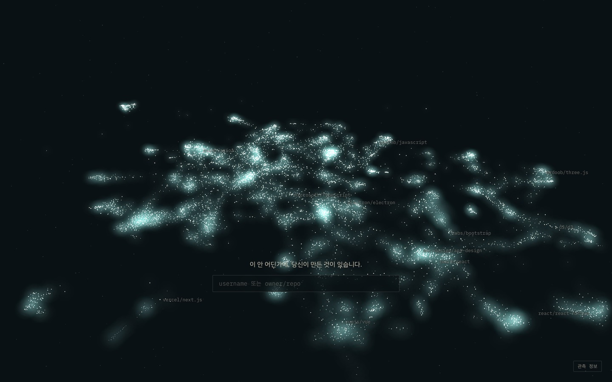
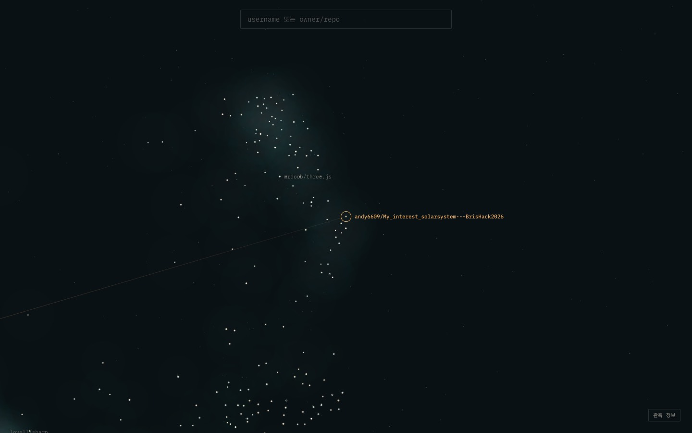
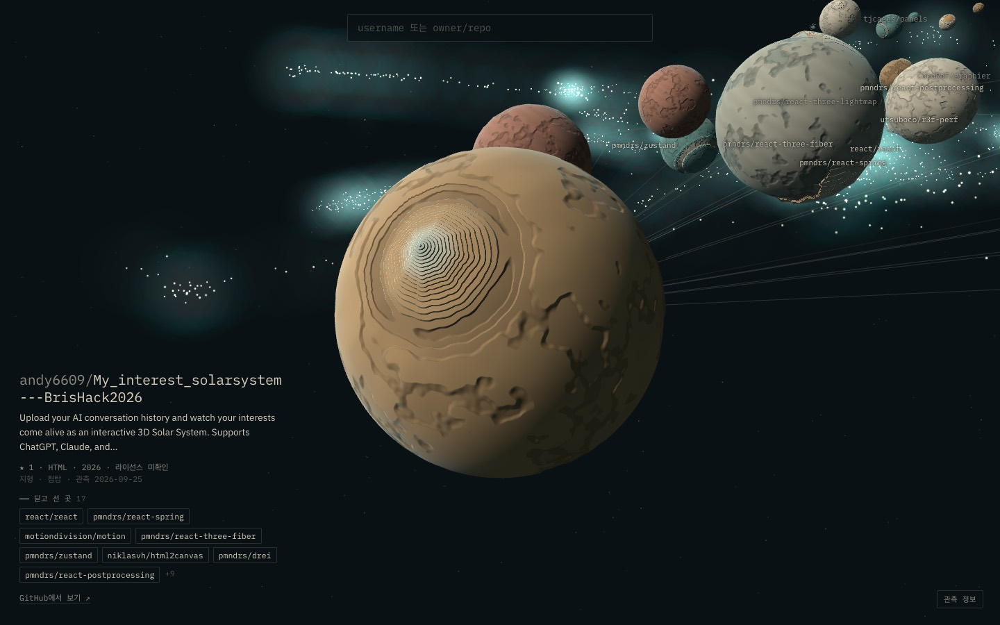
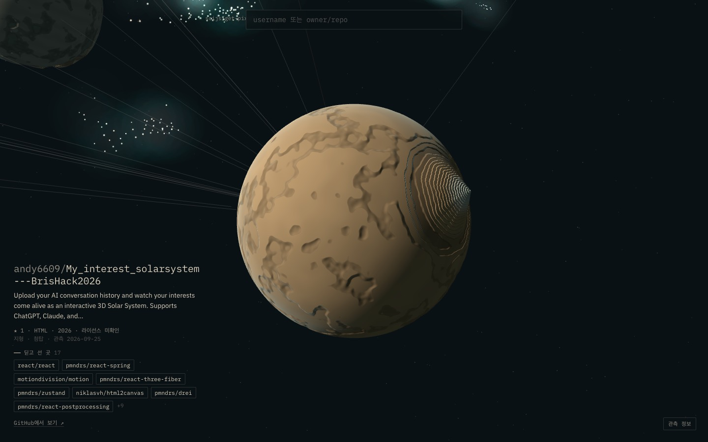
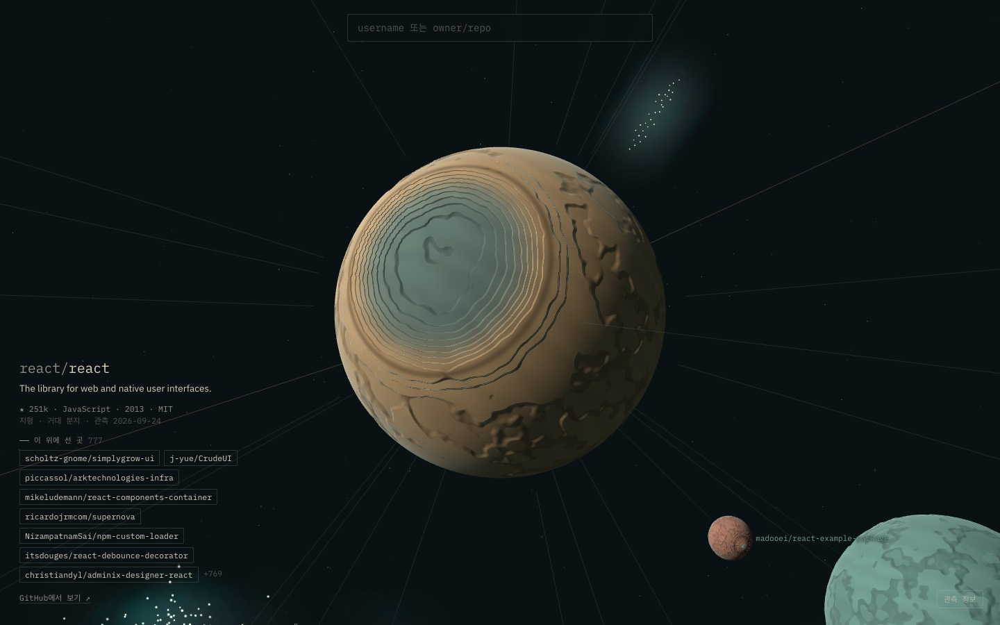
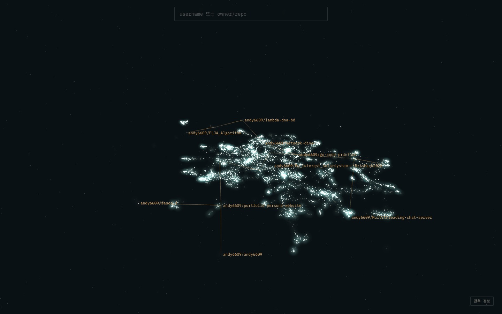
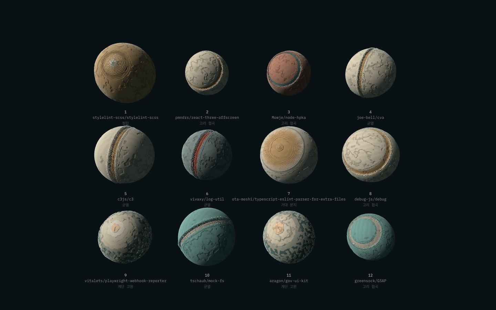

# E1 — 은하 지도

> 2026-09-26 · [PROTOTYPE_SPEC.md](../PROTOTYPE_SPEC.md) §4

**질문**: 관계로 만든 배치가 납득되는가? 검색 → 항해 → 도착이 끊기지 않는가?

## 결과

| 통과 기준 | 목표 | 결과 | |
|---|---|---|---|
| 이웃 일관성 | 무작위의 3배 이상 | **0.720** (무작위 0.041, **17.6배**) | 통과 |
| landmark 이웃 육안 검토 | 납득 | React·Svelte·three.js·d3 모두 자기 생태계 한가운데 (아래 예시) | 통과 |
| 데스크톱 60fps | 16.7ms | 은하 16.6 / 항해 16.6 / 궤도 16.6ms (p95 16.8) | 통과* |

\* Apple M4, 1440×900, DPR 1. 중급 Android·Safari·내장 GPU는 아직 재지 않았다.

**이웃 일관성**은 각 행성의 공간상 가장 가까운 10개 중 "관련 있음"(직접 항로 / 흔하지 않은 topic 공유 / 흔하지 않은 dependency 2개 이상 공유)의 비율이다. 기준은 [layout.py](../../pipeline/layout.py)의 `Relations`.

## 만든 것

| 파일 | 역할 |
|---|---|
| [pipeline/collect.py](../../pipeline/collect.py) | 표본 수집 → `data/build/collected.json` (캐시 `data/raw/cache/`) |
| [pipeline/layout.py](../../pipeline/layout.py) | 특징 → 항로 전파 → UMAP → 원반 → 장부 → 지표 → `galaxy.json` |
| [pipeline/eval_placement.py](../../pipeline/eval_placement.py) | 장부를 고정한 채 새 repo를 넣는 방식 검증 |
| [web/](../../web/) | Vite + React + R3F. 은하·항해·궤도·명판·개인 별자리·갤러리 |
| [web/scripts/shot.mjs](../../web/scripts/shot.mjs) | 장면 캡처 + 프레임 시간 |
| [web/scripts/check.mjs](../../web/scripts/check.mjs) | 흐름 스모크 테스트 11개 |

## 데이터

| 층 | 목표 비율 | repo |
|---|---|---|
| landmark | 20% | 1,600 |
| varied | 40% | 3,200 |
| small (stars < 20) | 25% | 2,000 |
| neighbor | 15% | 1,200 |
| include (andy6609, fork 제외) | 별도 | 16 |
| **합계** | | **8,016** |

- 확인된 항로 **24,048개** (runtime 21,220 / peer 2,828). 모두 deps.dev의 선언된 dependency에서 왔다.
- stars < 20인 행성이 **45%**(3,587개), 0-star가 1,450개. 유명 프로젝트만 있는 테마파크가 아니다 (DIRECTION K9).
- **관측 신선도**: repo 정보를 마지막으로 갱신한 날짜의 중앙값은 9일 전. 11.7%가 90일 이상, 4.3%가 1년 이상 지났다. 명판에 관측일을 붙이는 이유다 (K6).
- 수집 1분 이내 (캐시가 있으면 10초). ecosyste.ms 약 1,500회, deps.dev 약 8,000회.

## 배치에서 배운 것

### 1. React가 ESLint 플러그인 사이에 놓였다 → 항로 전파
처음 배치(3천 개)에서 `react/react`의 이웃 8개가 전부 ESLint 플러그인이었다. 원인은 두 가지였다.
- React 모노레포의 패키지 16개 중 하나(eslint-plugin-react-hooks)의 키워드 `eslint`가 repo 전체의 특징이 됐다.
- 표본 안에서 React를 딛고 선 repo가 284개인데, 그 관계가 좌표에 거의 반영되지 않았다.

고친 것:
- 패키지 키워드는 **그 키워드를 가진 패키지 비율의 제곱근**으로 가중한다. repo topics는 그대로.
- **항로 전파**: 확인된 항로로 이어진 이웃들의 특징 벡터 평균을 섞는다 (α=0.5, 1회).

| α | 반복 | 특징 공간 일관성 | hub 이웃 중 직접 항로 비율 |
|---|---|---|---|
| 0 | – | 0.843 | 0.500 |
| 0.3 | 1 | 0.837 | 0.714 |
| **0.5** | **1** | **0.833** | **0.729** |
| 0.5 | 2 | 0.791 | 0.829 |
| 0.8 | 2 | 0.740 | 0.843 |

hub = react, svelte, three.js, vue, express, d3, eslint. α=0.5·1회가 전체 일관성을 거의 잃지 않으면서 hub를 제자리로 보낸다.

### 2. owner 토큰은 개인 repo를 주제와 상관없이 뭉친다 → 제거
owner를 약한 신호(0.15)로 넣었더니, 사용자 repo 이웃의 **98%**가 자기 repo였다. 빼면 **1%**. 설명이 짧은 개인 repo일수록 owner 토큰이 지배한다. 뭉쳐 버리면 "내 별자리는 여러 지역에 걸쳐 있다"(DIRECTION D1)가 성립하지 않는다. 같은 사람의 행성은 **선(개인 별자리)**으로 잇는다 → DIRECTION D10.

### 3. npm 밖의 repo는 설명만으로 자리를 잡는다 — 약하다
- `andy6609/My_interest_solarsystem---BrisHack2026`은 `package.json`의 dependency 17개가 있어서 이웃이 **r3f-perf, drei, react-postprocessing**이다. 실제 관계가 있는 곳이다.
- `andy6609/network-dive-`("Scroll-driven cinematic landing page…")는 설명 단어만으로 놓여 파일 유틸 사이에 섰다. 관련 없음.
- Go·C++·Python repo도 설명 단어로 놓인다 (예: "message passing, no shared state" → 상태 관리 라이브러리 옆).
- 설명·topics·dependency가 모두 부족한 **16개**는 관계 미확정 지역(바깥 고리)에 있다. 그중 7개가 사용자 repo다.

→ 열린 문제. 후보: README 의미 정보(PLAN.md D), 언어 생태계별 지역, "npm 밖" 지역을 따로 두기.

### 4. 장부 고정 + 새 repo 추가는 전체 재배치의 89% 품질 → D6 유지
[eval_placement.py](../../pipeline/eval_placement.py): 90%로 배치한 뒤 나머지 10%(801개)를 기존 행성을 움직이지 않고 추가.

| | 이웃 일관성 |
|---|---|
| 추가한 801개 (장부 고정) | **0.638** |
| 같은 801개, 전체를 한 번에 배치했다면 | 0.713 |
| 기존 행성 (추가 후) | 0.718 |
| 무작위 | 0.042 |

기존 행성 이동 0, 최소 간격 4.0 유지, 801개 추가에 0.21초. 파이프라인을 다시 돌리면 "새로 배치 0, 기존 유지 8016"이 나온다.

### landmark 이웃 예시 (공간상 가장 가까운 6개)
- **react/react** — simplygrow-ui, CrudeUI, arktechnologies-infra, react-components-container … (대부분 항로)
- **mrdoob/three.js** — threejs-create, zomboid-models, g.frame, detect-gpu, makio-meshline, troika
- **sveltejs/svelte** — svelte-on-solana-wallet-adapter, wallet-standard-svelte, elderjs, devalue, **sveltejs/kit**
- **d3/d3** — d3-path, nvd3, angular-nvd3, billboard.js, d3-org-tree, neo4jd3

## 행성 셰이더 — E2로 넘기는 것

원형 6개(거대 분지·고리 협곡·첨탑·균열·반구 절벽·계단 고원), 층 양자화, 픽셀 단위 법선, 5개 팔레트, 언어 → 결 무늬.

첫 갤러리에서 **오트밀 문제**가 바로 보였고, E1 안에서 고친 것:
1. 랜드마크가 카메라 반대편에 있으면 잔무늬 공만 보인다 → 도착 구도를 **랜드마크가 화면 좌상단(빛 쪽) 26°**에 오도록 바꿨다. 갤러리도 같은 구도로 행성을 돌린다.
2. 잔무늬 노이즈가 강해 모든 행성이 같은 공이 된다 → 진폭을 절반으로.
3. 반구 절벽의 절벽선이 정면에서 안 보였다 → 절벽선이 축을 지나도록 다시 설계.
4. 랜드마크 윤곽을 가는 선으로 새긴다.

남은 것 (E2):
- 절벽과 균열이 둘 다 "면을 가르는 선"으로 읽힌다.
- 계단 고원이 약하다 (작은 원판 하나로 보인다).
- 원형 6 × 팔레트 5 = 30조합. 8천 개면 조합당 평균 267개가 같은 인상이다 → 부차 특징이나 원형 추가가 필요하다.

## 흐름 — 스모크 테스트 11개 통과
npm 패키지 이름 → repo / Esc 건너뛰기(0.35초) / GitHub URL → repo / 없는 repo는 관측 범위를 밝힘 / 모호한 입력에만 후보 / username → 개인 별자리 / `?r=` 진입 후 영구 주소 `?p=`로 교체 / `?p=` 진입 / 명판 메타 / 이동 기록(E5용) / 페이지 오류 없음

## 스펙에서 바꾼 것
- 표본 3,000 → **8,016** (스펙 상한 10,000 안).
- dependency 소스 npm registry → **deps.dev** (npm registry는 동시 요청 16개에 429, `retry-after: 409`).
- 데이터 예산을 "gzip 전 3MB"에서 **"전송량(gzip) 1MB"**로. `galaxy.json`은 3.19MB, gzip 928KB. PLAN.md의 예산도 압축 후 전송량 기준이다.

## 캡처

| | |
|---|---|
|  첫 화면 |  항해 중: 목적지 링, 지나가는 이름 |
|  도착: 첨탑이 좌상단, 하늘에 r3f 이웃 |  돌려 보면 첨탑이 실루엣으로 |
|  항로로 이동한 React: 거대 분지 |  andy6609의 개인 별자리 |
|  갤러리 (seed=5) | |

## 다음
1. **E2 행성 원형** — 위의 남은 것 + 오트밀 테스트.
2. npm 밖 repo 배치 (열린 문제 3).
3. 중급 기기·Safari·모바일 측정.
4. E4 하늘 — 화면 밖 목적지 방향 표시, 명판 목록 없이 고르기.
