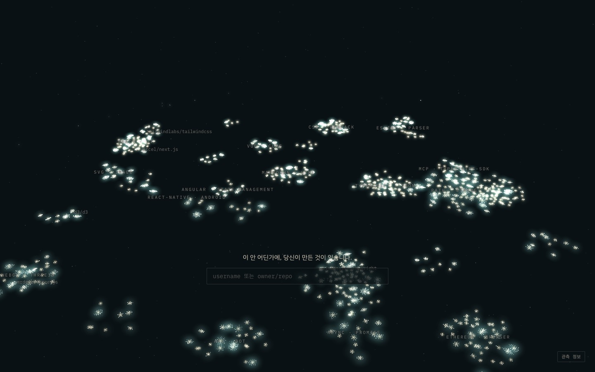
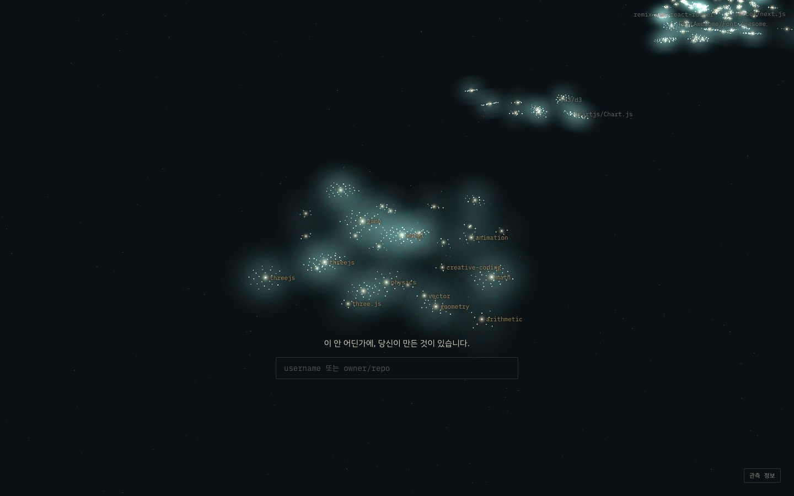
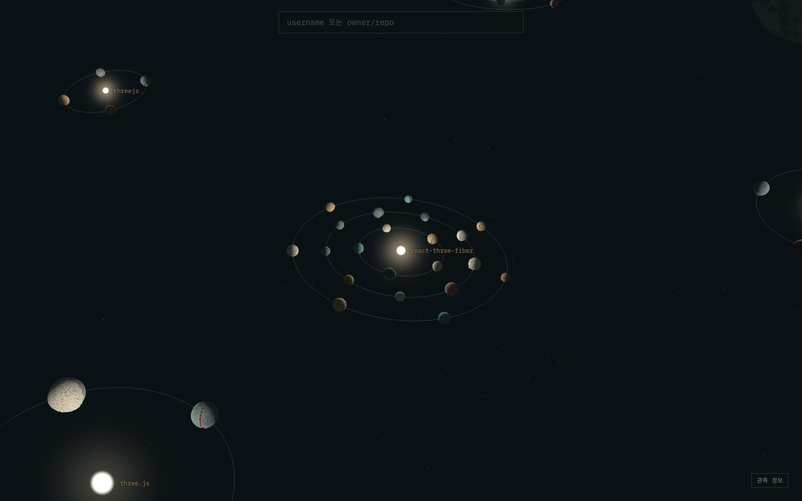
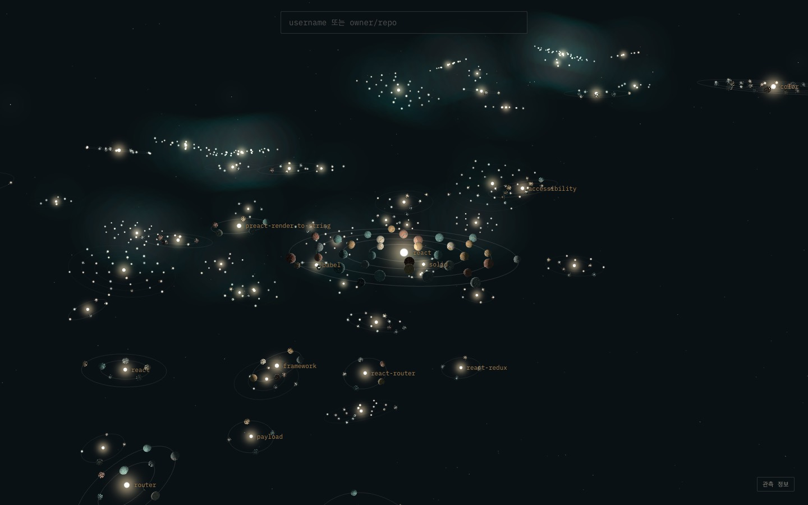
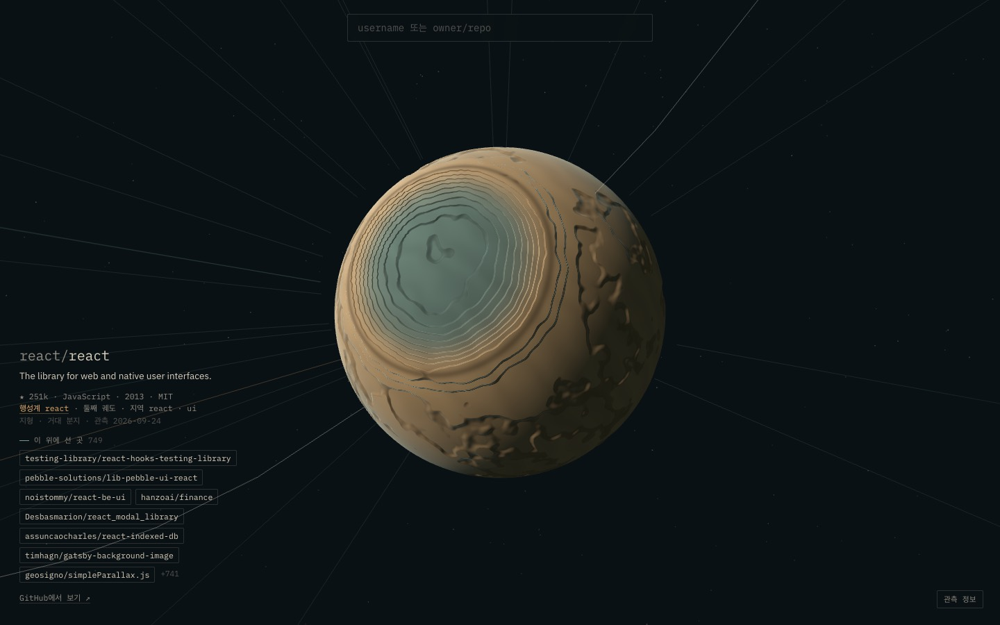

# E1b — 지역과 행성계

> 2026-09-26 · E1 직후 사용자 피드백으로 진행 · 결정: [DIRECTION.md](../DIRECTION.md) D12, D13

**피드백**: "지역끼리 거리가 가깝게 느껴지고, 확대하면 그냥 원들이 퍼져 있는 느낌. 행성계나 은하계처럼 구분됐으면."

**원인**: E1은 UMAP 결과를 원반으로 눕히기만 했다. UMAP은 이웃 관계를 잘 지키지만, 묶음 사이를 비우지도 않고 묶음 안을 구조화하지도 않는다. 그래서 먼 거리에서는 이어진 덩어리로, 가까이서는 고르게 흩어진 점으로 보였다.

## 바꾼 것 — 배치 v2

```
은하 ─ 지역 25개 ─ 행성계 703개 ─ 궤도 ─ 행성 8,016개
```

| 층 | 만드는 법 | 보이는 모습 |
|---|---|---|
| 지역 | 관계망(특징 이웃 12개 + 확인된 항로)에 Leiden, 해상도 0.5. 40개 미만은 가장 강하게 이어진 지역에 합침 | 지역 사이에 170 단위 빈 공간. 은하 배율에서 이름표 |
| 행성계 | 지역 안에서 Leiden을 다시 돌리고, 36개보다 크면 해상도를 올려 또 나눔. 4개 미만은 합침 | 중심별 둘레의 궤도. 행성계 사이 16 단위 빈 공간 |
| 궤도 | 행성계의 평균 특징에 가까운 순서로 안쪽 궤도부터 채움 (첫 궤도 반지름 6, 간격 4.5, 같은 궤도 위 간격 7) | 궤도면은 은하 원반에서 최대 24° 기울어짐 |
| 중심별 | **repo가 아니다.** 구성원이 공유하는 topic·dependency 중 전체보다 두드러지는 것을 이름으로 붙임 | 선택하면 그 행성계를 비춘다 |

- 지역·행성계의 상대 위치는 여전히 UMAP 배치에서 가져온다. 관계가 가까운 지역은 가까이 있다.
- 행성은 **자기 별의 빛**을 받는다. 지형은 그대로 두고 방향만 정해서, 도착하면 별빛이 화면 좌상단에서 비껴 들어오고 랜드마크가 그 빛 쪽에 온다 (D13).
- 배치 버전이 다르면 파이프라인이 멈춘다. `--reset-ledger`를 명시해야 좌표를 바꿀 수 있다.

지역 이름 (큰 순서): http · testing, react · ui, path · string, typescript · json, cli · terminal, markdown · html, css · webpack, ethereum · browser, **webgl · threejs**, eslint · parser, mcp · typescript-sdk, react-native · android, api · bot, vue · core, svg · image, async · promise, angular · state-management, d3 · visualization, stream · readable, aws · serverless, editor · wysiwyg, wasm · webassembly, graphql · apollo, svelte · component, i18n · internationalization

## 숫자

| | v1 (E1) | v2 |
|---|---|---|
| 이웃 일관성 (무작위 대비) | 0.720 (17.6배) | **0.712 (18.1배)** |
| 같은 행성계 구성원끼리 관련 있는 비율 | – | **0.750** |
| 새 repo 추가 (장부 고정) / 전체 재배치 | 0.638 / 0.713 (89%) | **0.727 / 0.727 (100%)** |
| 새 repo 중 기존 행성계에 들어간 비율 | – | 783 / 801 |
| 최소 간격 | 4.0 | 4.5 |
| 행성계 크기 | – | 중앙값 7, 상위 10% 27 이상, 최소 4 |

이웃 일관성은 거의 그대로이고, **장부를 고정한 채 새 repo를 넣는 방식은 오히려 좋아졌다**. 새 repo는 가장 비슷한 행성계의 바깥 궤도로 들어가면 되기 때문이다.

### 사용자 행성의 자리
- `andy6609/My_interest_solarsystem---BrisHack2026` → 지역 **webgl · threejs**, 행성계 **react-three-fiber**, 셋째 궤도
- `react/react` → 지역 react · ui, 행성계 react
- `sveltejs/svelte` → 지역 svelte · component, 행성계 svelte

## 같이 고친 것 — 스팸
"next.js · tea"라는 지역이 생겼다. npm의 tea.xyz 보상을 노린 스팸 패키지들이 서로 의존해서, "표본이 많이 쓰는 dependency" 이웃으로 뽑혀 들어온 것이었다. create-next-app 템플릿 그대로인 repo도 섞여 있었다. 수집 단계에서 템플릿 설명과 tea 태그를 거른다 ([collect.py](../../pipeline/collect.py) `is_spam`, 후보 중 55개). PLAN.md O의 "조작이 세계를 왜곡" 위험이 실제로 나타난 사례다.

## 캡처

| | |
|---|---|
|  은하: 지역이 빈 공간으로 나뉜다 |  지역 webgl · threejs: 중심별 이름 |
|  행성계 react-three-fiber |  react 행성계와 이웃 행성계들 |
|  도착: 다른 행성계의 궤도는 옅어진다 | |

## 남은 것
- **도착 화면에서 같은 행성계의 이웃과 별이 잘 안 보인다.** 별빛이 옆에서 들어오는 구도라 별과 이웃이 화면 밖에 있다 → E4(화면 밖 목적지 방향 표시)에서 다룬다.
- 은하 배율에서 지역 이름과 유명 repo 이름이 서로 자리를 다툰다.
- 행성계 이름이 겹친다 (react 지역에 "react" 행성계가 여럿). 지역 안에서 이름이 겹치면 두 번째 토큰을 붙이는 방법을 검토한다.
