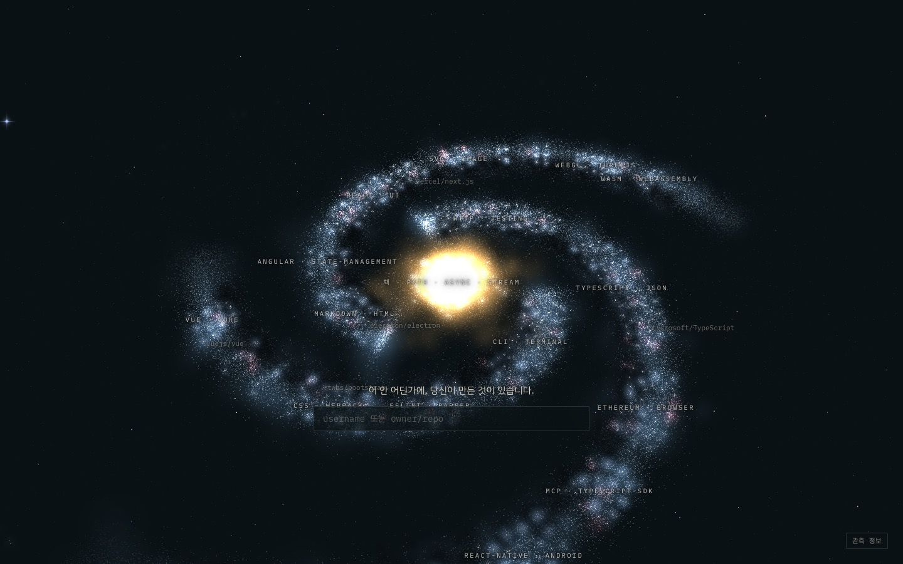
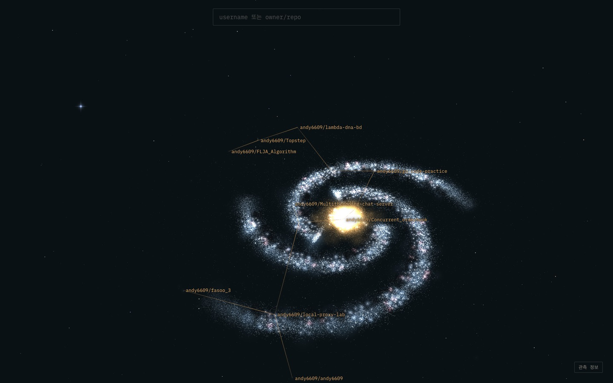
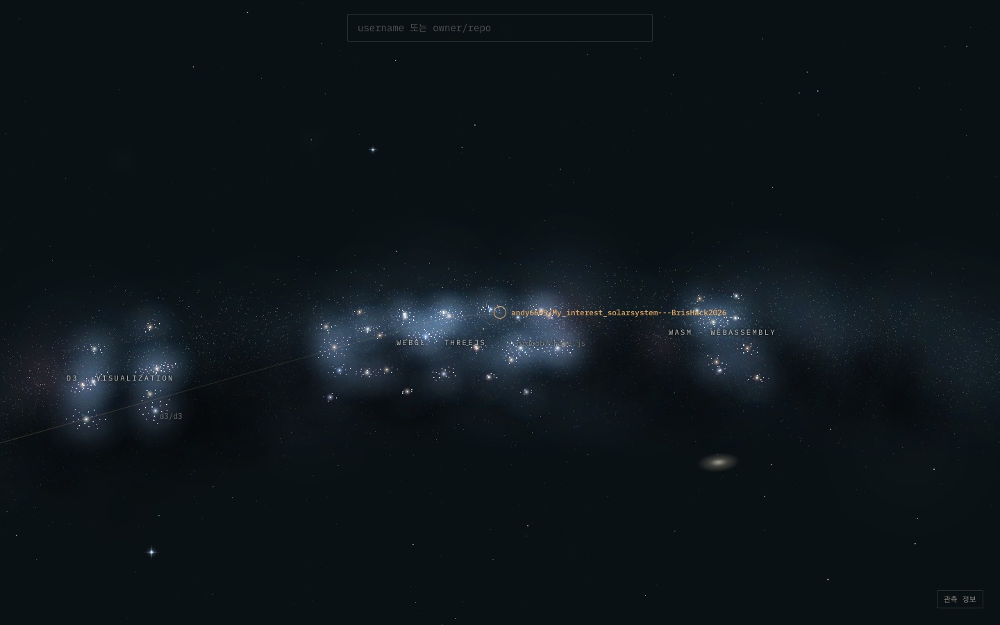
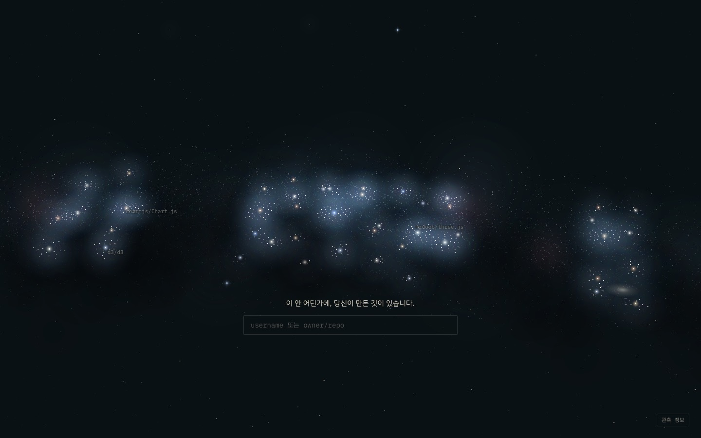
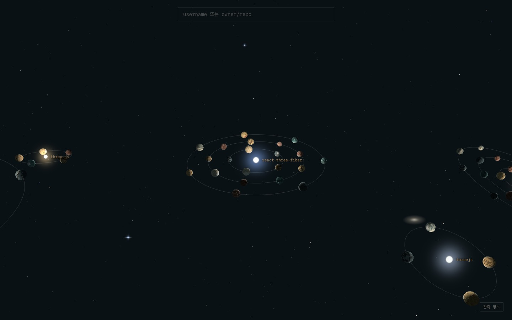

# E1c — 나선 은하

> 2026-09-26 · 사용자 피드백으로 진행 · 결정: [DIRECTION.md](../DIRECTION.md) D14, D15

**피드백** (실제 은하 사진 세 장과 당시 화면을 비교하며): "행성들이 모여서 만든 느낌밖에 없다. 주변에 별도 없고, 보는 맛이 나도록."

**원인**: 화면에 **데이터 층만** 있었다. 은하 사진이 보는 맛을 주는 요소 — 나선팔, 빛나는 핵, 팔을 따라 흐르는 별빛과 성운, 먼지띠, 배경 별, 먼 은하 — 가 하나도 없었다. 지역도 UMAP 자리에 섬처럼 놓여서 은하의 모양이 아니었다.

## 바꾼 것

### 1. 데이터 층 — 지역을 나선팔 위에 (배치 v3)
- **핵** = 다른 지역이 가장 많이 딛고 선 지역 (다른 지역에서 들어오는 항로 ÷ 크기). 행성 1,100개까지.
- **팔 3개**: 나머지 지역을 기반인 순서대로 안쪽부터 놓는다. 각 지역은 이미 그 팔에 있는 지역들과 가장 많이 이어진 팔로 간다 (평균 연결 강도, 팔 크기 쏠림에 벌점).
- 지역 안의 행성계는 팔을 따라 휜 띠에 편다 (UMAP 상대 위치의 주축 두 개에서 시작). 팔 사이·지역 사이는 여전히 비어 있다.

| 자리 | 지역 (안쪽 → 바깥) |
|---|---|
| 핵 | path · string, async · promise, stream · readable |
| 팔 1 — 서버·서비스 | http · testing → typescript · json → ethereum · browser → mcp · typescript-sdk → react-native · android → graphql · apollo → aws · serverless → api · bot |
| 팔 2 — 도구 → 프레임워크 | cli · terminal → eslint · parser → css · webpack → i18n → svelte · component → vue · core |
| 팔 3 — 화면·그래픽 | markdown · html → angular · state-management → react · ui → svg · image → editor · wysiwyg → d3 · visualization → **webgl · threejs** → wasm · webassembly |

**은하 중심에서 바깥으로 = 기반에서 응용으로.** 방향 자체가 의미를 가진다.

| | v2 | v3 |
|---|---|---|
| 이웃 일관성 | 0.712 | 0.705 |
| 같은 행성계 관련 비율 | 0.750 | 0.750 |
| 새 repo 추가 (장부 고정) / 전체 재배치 | 0.727 / 0.727 | 0.728 / 0.714 |

### 2. 연출 층 — 선택할 수 없고 repo로 세지 않는다 ([Backdrop.tsx](../../web/src/world/Backdrop.tsx))
- **팔의 별빛**: 실제 지역이 놓인 나선(`galaxy.json`의 `galaxy`)을 그대로 따라 뿌린 푸른 별빛과 부드러운 빛. 팔 끝으로 갈수록 가늘고 흐려진다.
- **실제 행성계 둘레의 별빛**: 팔의 밝은 매듭이 데이터가 있는 자리와 맞도록.
- **분홍 성운**(HII 영역)과 **먼지띠**(팔 안쪽 가장자리의 어두운 자국).
- **핵**: 납작한 팽대부, 안쪽은 흰빛에서 바깥은 주황으로.
- **하늘**: 카메라를 따라다니는 배경 별 9,000개 (은하수 띠, 밝기는 멱법칙, 색은 별 온도), 십자 광채가 있는 밝은 별 26개, 먼 은하 9개.
- **중심별의 색**: 행성계 키로 정해지는 별 온도 (파랑은 드물고 노랑·주황이 흔함).
- 은하 배율에서는 **행성 광점과 중심별을 작고 흐리게** 물려서 팔의 빛이 주인공이 되게 했다. 가까이 가면 원래대로 돌아온다.

프레임 시간은 그대로 16.6ms (Apple M4). 흐름 테스트 11개 통과.

## 캡처

| | |
|---|---|
|  첫 화면: 핵 · 팔 3개 · 성운 · 먼지띠 |  andy6609의 별자리가 은하를 가로지른다 |
|  항해: 팔 속을 지난다 (webgl · threejs) |  지역: 팔의 빛 속 행성계들 |
|  행성계: 별 온도색, 배경 별, 먼 은하 | |

## 남은 것
- 팔이 고르고 매끈하다. 실제 은하처럼 조각나고 갈라지는 팔(flocculent)은 아직 없다.
- 핵이 여전히 밝게 탄다 (핵 지역의 실제 행성·중심별 빛이 더해진다).
- 행성계 배율에서 "팔 속에 있다"는 느낌이 약하다. 가까운 별빛의 시차를 더 줄 수 있다.
- 먼 은하들은 지금은 장식이다. 나중에 다른 생태계(PyPI, Cargo …)를 관측하면 **실제로 다른 은하**가 될 수 있다.
