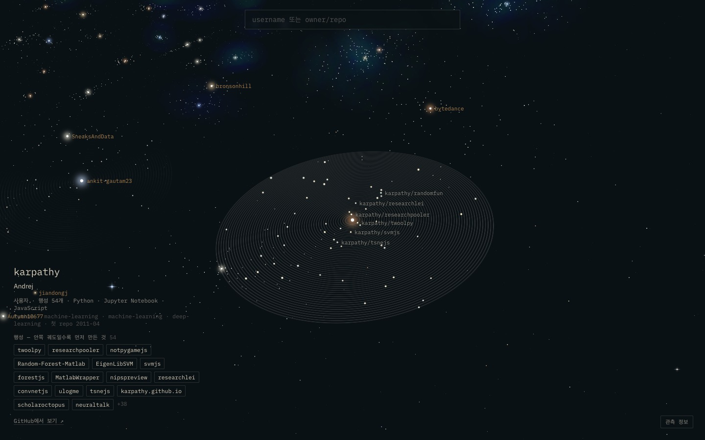
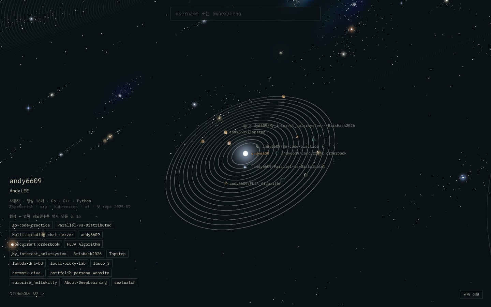
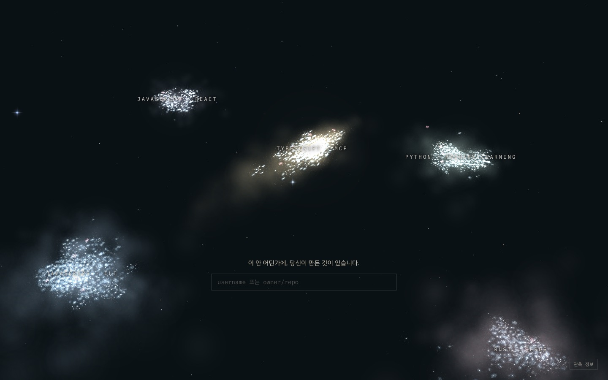
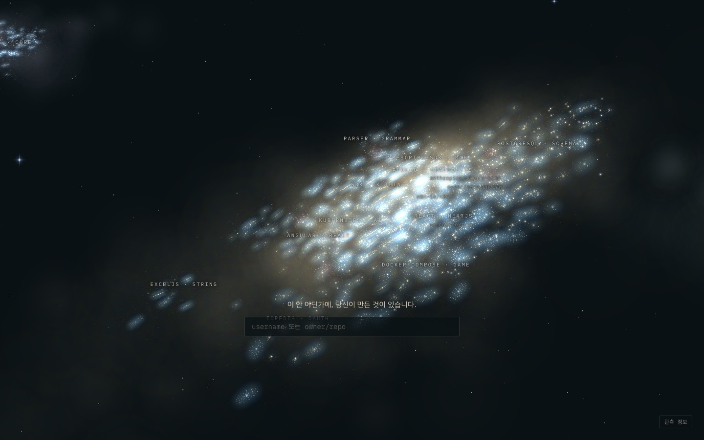
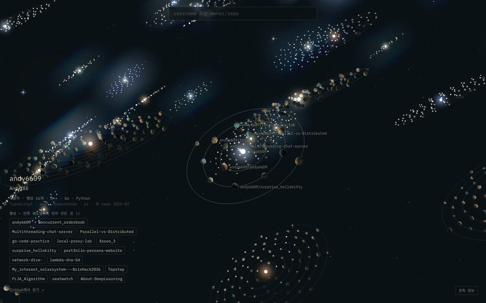
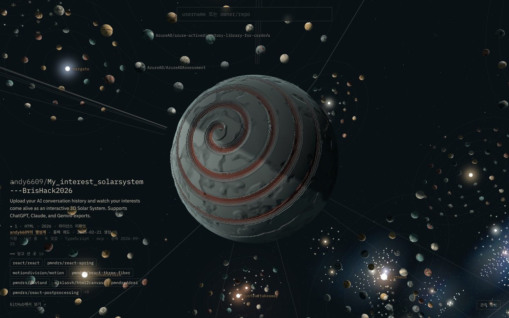
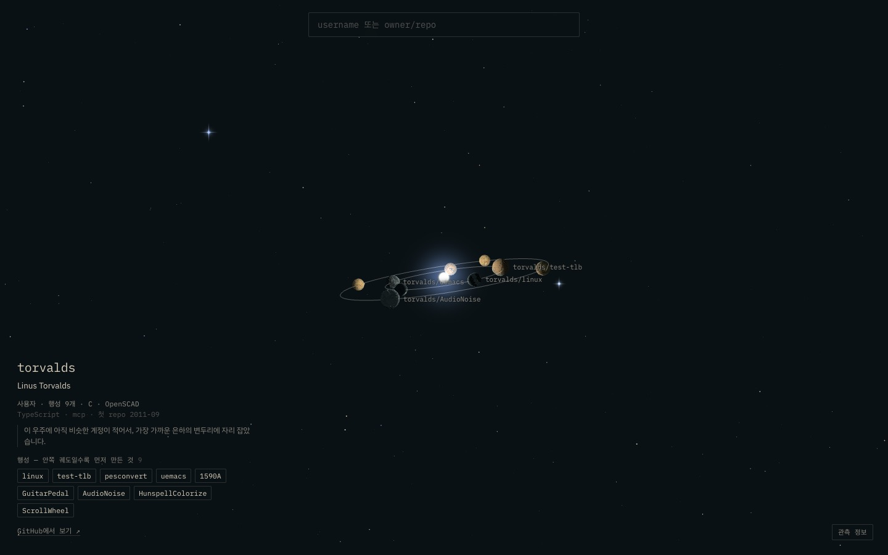

# E1d — 계정 = 행성계, 검색하면 들이기

> 2026-09-26 · 사용자 피드백으로 진행 · 결정: [DIRECTION.md](../DIRECTION.md) D16, D17, D18

**피드백**: "내 계정마다 행성계가 생기면 좋겠다. repo를 아무 기준으로 채워 넣는 건 별로 — B, 데이터가 만든 모양으로. 목표는 Git City처럼 다른 사람들 repo를 다 끼워 넣는 것이니 은하도 더 많아져야 한다."
**선택**: 궤도 = 만든 순서 · 범위 = 1+2단계 (정적 표본 + 검색한 계정을 서버가 들인다) · 은하는 계정을 쪼개지 않는다.

## 바꾼 것

### 1. 단위가 계정이 됐다 (배치 v4, [universe.py](../../pipeline/universe.py))
- **별 = 계정**, **행성 = 그 계정의 공개 repo** (fork 제외, 최근 push 순 100개까지). 궤도는 **만든 순서** — 안쪽일수록 먼저 만든 것.
- 표본: npm 표본의 owner 1,391 · PyPI 494 · Cargo 344 · include 1 (andy6609) → **계정 2,230, 행성 70,064, 항로 9,129**. 100개가 넘어 잘린 계정 482.
- 계정 벡터 = 그 계정의 정보 있는 repo 벡터 평균 (TF-IDF → SVD 64 → 항로 따라 한 번 퍼뜨림). 설명·토픽이 없는 repo는 궤도에는 있지만 계정의 자리를 정하는 데는 쓰지 않는다.
- sklearn `sublinear_tf`가 0.3 같은 약한 가중치를 음수로 뒤집던 문제를 직접 짠 `sublinear()`로 고쳤다.

### 2. 은하와 모양을 데이터가 정한다
- **은하** = 계정 kNN + dependency 그래프의 Leiden 공동체 (낮은 해상도, 4–9개 목표). 생태계(npm/PyPI/Cargo)로 미리 가르지 않는다 — 한 계정이 둘로 쪼개지지 않는다. 언어는 이름과 재질로만 드러난다.
- **지역** = 은하 안에서 다시 Leiden. **모양** = 계정 벡터의 UMAP 3D → 은하마다 주축 원반으로 눌러 펴고 → 행성계끼리 겹치지 않게 밀어낸다. 나선을 강제하지 않는다.
- 이름은 계정 단위로 센다 (언어·일반어 SKIP). "Python · python", "—" 같은 이름이 사라졌다.

| 은하 | 계정 | 지역 예 |
|---|---|---|
| JavaScript · cli | 602 | browser · console, express · cli, async · stream |
| TypeScript · mcp | 571 | react · nextjs, kubernetes · ai, claude-code · mcp, postgresql · schema |
| Python · machine-learning | 461 | machine-learning · deep-learning, django · flask, numpy · packaging |
| Rust · serde | 317 | serde · no-std, wasm · no-std, terminal · cli |
| JavaScript · react | 269 | vue · core, react · android, web-components · custom-elements |

지역 44개, 정보 있는 repo가 없어 우주 가장자리 "잃어버린 궤도"로 간 계정 10개.

| 지표 | 값 |
|---|---|
| 공간상 이웃 계정과의 벡터 유사도 | **0.656** (무작위 0.290) |
| `/api/world` 크기 · 응답 | gzip 1.96MB · 1.46s |
| 프레임 시간 (Apple M4, 은하·항해·궤도) | 16.6ms |

### 3. 장부와 서버 ([server/](../../server/))
- 좌표 장부가 `data/universe.db`(SQLite)로 옮겨졌다. 배치는 `--reset` 없이 장부를 덮지 않는다. 배치 때의 모델(IDF·SVD)을 `data/model/`에 고정해 둔다.
- 모르는 username을 검색하면 서버가 **그때 들인다**: GitHub(토큰 없으면 시간당 60회) → 안 되면 ecosyste.ms → 이름으로 패키지 찾기 → deps.dev dependency → 고정 모델로 벡터 → 가장 비슷한 계정 8개의 은하·지역 → 그 근처 빈자리. **이미 놓인 행성계는 움직이지 않는다.**
- **약한 일치**: 가장 비슷한 8개와의 유사도가 표본의 하위 10%(0.671)보다 낮으면, 억지로 지역에 끼우지 않고 가장 가까운 은하의 **변두리**에 놓는다 (명판에 이유를 적는다).

검증 ([eval_ingest.py](../../pipeline/eval_ingest.py)): 계정 10%(222개)를 빼고 서버 방식으로 다시 놓았다.

| | 값 |
|---|---|
| 배치 때와 같은 은하 | **0.892** |
| 이웃 유사도 — 다시 놓은 자리 / 배치 자리 / 무작위 | 0.612 / 0.646 / 0.283 |

실제로 들여 본 계정:

| 계정 | 자리 | 행성 |
|---|---|---|
| karpathy | Python · machine-learning / machine-learning · deep-learning | 54 |
| antirez | Python · machine-learning / Python | 94 |
| torvalds | TypeScript · mcp **변두리** (C · OpenSCAD — 비슷한 계정 없음) | 9 |
| octocat | JavaScript · cli **변두리** | 6 |

표본 안 계정: andy6609 → TypeScript · mcp / kubernetes · ai (16), mrdoob → JavaScript · cli / json, dtolnay → Rust · serde.

### 4. 화면
- 은하 배율: 은하 이름, 행성계 둘레·지역·은하 원반을 **데이터가 있는 자리만** 따라가는 먼지와 빛 (D15의 연출 층, 이제 계정과 지역을 따른다). 가짜 먼 은하는 뺐다 — 은하가 실제로 여러 개가 됐으므로.
- 행성계 배율: 별 색은 계정마다, 궤도는 만든 순서, 명판에 첫 repo 연도·언어·은하·지역. 개인 별자리는 행성계 자체로 대체됐다.
- 7만 개 행성의 도착 방향·자전을 처음에 다 계산하던 것을 필요할 때 계산하도록 바꿨다.
- 흐름 테스트 14개 통과 (`NEW_LOGIN=antirez`로 새 계정 들이기 포함).

### 5. 궤도 하나에 행성 하나 (배치 v5, D19)
사용자 피드백("궤도 하나에는 행성 하나만 있어야 하지?")으로 v4의 "궤도마다 여러 개"를 바꿨다.
- k번째 repo → k번째 궤도, 반지름 6 + 2k. 각도는 이웃 궤도 행성과 붙지 않게.
- 행성계 반지름 중앙값 18 → 53, 최대 39 → 207. 은하 반지름 약 1,100 → 4,300, 우주 반지름 6.4k → 22k. 은하·지역·이웃 유사도는 v4와 같다 (0.656).
- 화면: 궤도는 셰이더 한 장, 거리 기준은 `World.scale`(은하 반지름 비례), near 평면은 보는 거리에 맞춰 바꾼다. 행성에 도착하면 다른 행성계의 궤도는 지운다.
- 흐름 테스트 14개 통과 (`NEW_LOGIN=mitchellh`), 프레임 16.5ms 그대로.

| | |
|---|---|
|  karpathy: 행성 54개, 궤도 54개 |  andy6609: 행성 16개, 궤도 16개 |

## 캡처 (v4)

| | |
|---|---|
|  첫 화면: 데이터가 만든 은하 5개 |  은하 배율: 지역과 행성계 |
|  andy6609의 행성계 — 안쪽이 먼저 만든 repo |  행성 궤도 도착 |
|  torvalds: 비슷한 계정이 없어 변두리에 | |

## 남은 것
- **표본에 C · Go · Java · 시스템 쪽 생태계가 없다.** 그래서 torvalds 같은 계정이 변두리로 간다. 다음 표본은 Go modules · Maven · 인기 C 프로젝트 owner를 더하는 것이 가장 효과가 크다. 들인 계정이 쌓이면 모델을 다시 맞추는 시점(장부는 유지)도 정해야 한다.
- 지역 이름이 여전히 약한 곳이 있다 ("Python", "json", 같은 이름 두 번 "serde · no-std").
- 도착 화면에서 그 행성의 별과 이웃 행성이 잘 안 보인다.
- 원반 나선 홈의 계단 현상.
- 사람 대상 오트밀 테스트(E2)는 아직 하지 않았다.
- ecosyste.ms 데이터가 CC BY-SA 4.0 — 공개 배포 전에 파생 데이터 라이선스 표기 정리가 필요하다.
