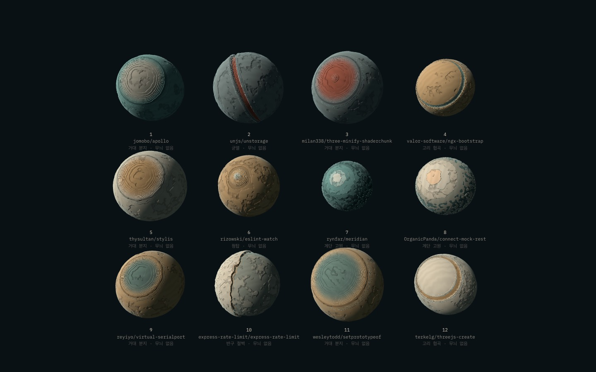
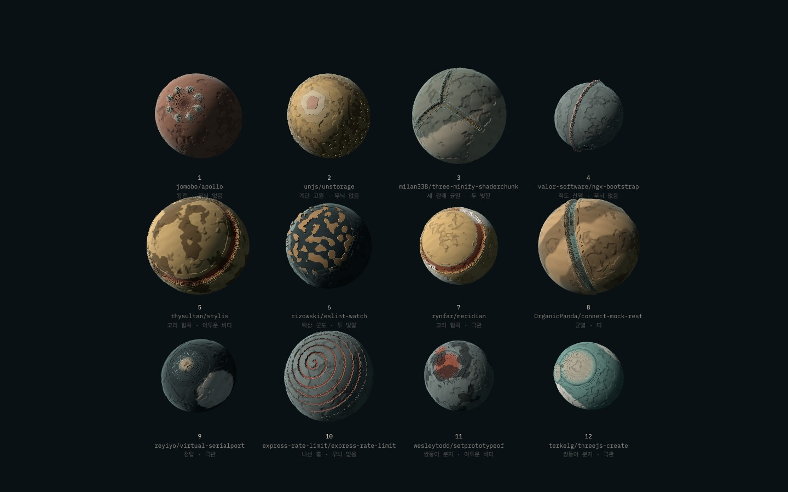
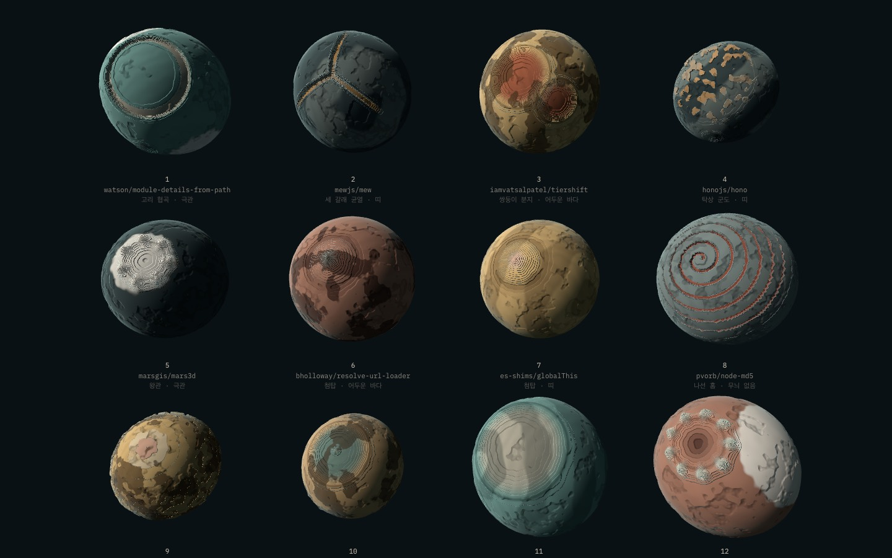
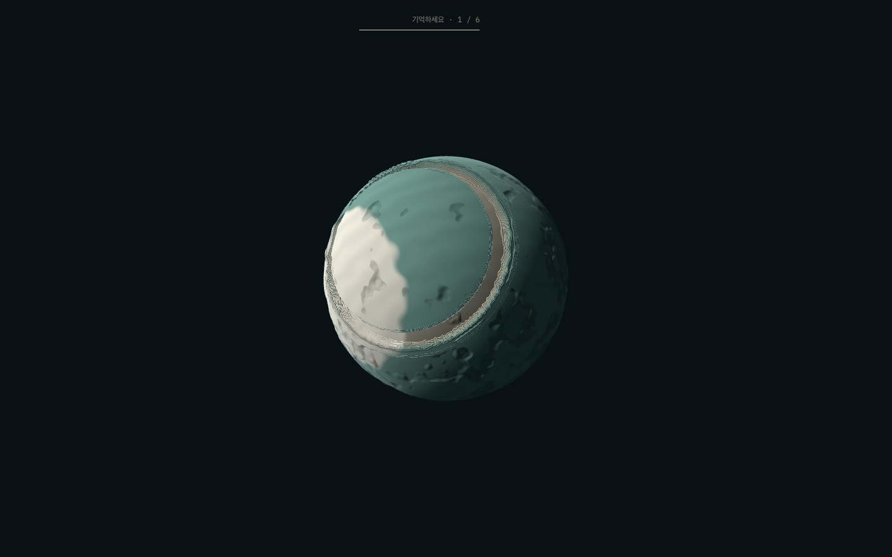
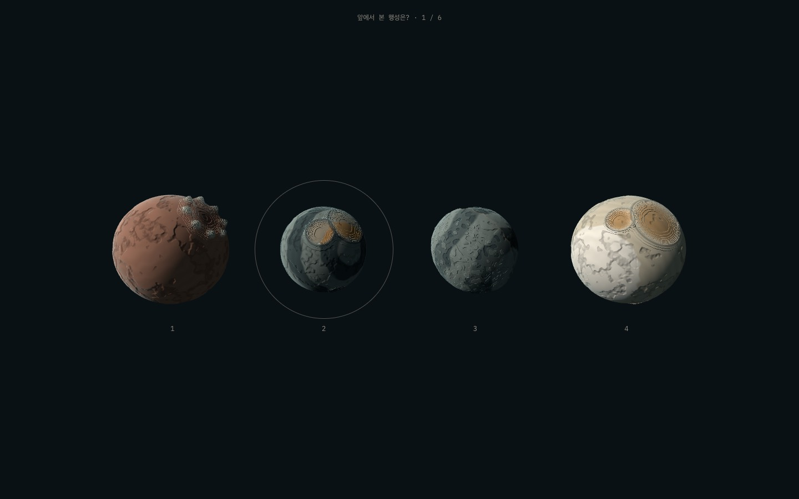
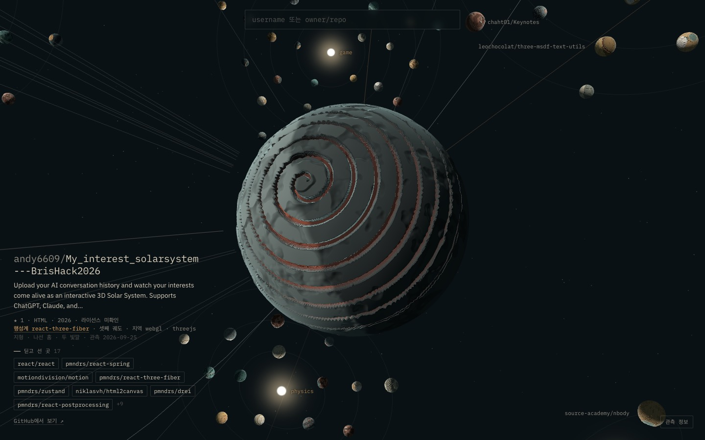

# E2 — 행성 원형

> 2026-09-26 · [PROTOTYPE_SPEC.md](../PROTOTYPE_SPEC.md) §4 · 결정: [DIRECTION.md](../DIRECTION.md) D3

**질문**: seed만으로 기억에 남는 행성이 나오는가? ("만 개의 오트밀 그릇"을 피하는가)

**통과 기준**: 사람 대상 오트밀 테스트 정답률 75% 이상 → **아직 사람을 대상으로 재지 않았다.** 테스트 페이지와 진행 방법까지 준비했다 (아래).

## 결과 요약

| | v1 (E1) | v2 (E2) |
|---|---|---|
| 랜드마크 원형 | 6 | **12** |
| 팔레트 | 5 | **7** (먹, 모래 추가 — PLAN.md K 팔레트에서 파생) |
| 무늬 | 없음 | **5종** (없음 / 두 빛깔 / 띠 / 어두운 바다 / 극관) |
| 부차 분화구 | 없음 | 행성의 75%, 랜드마크에서 70° 이상 떨어진 곳 |
| 조합 수 (원형 × 팔레트 × 무늬) | 30 | 420 (+ 부차 분화구·연속 파라미터) |
| 대리 지표: 색·밝기 분포 (65° 돌림) | 0.244 | **0.350** |
| 대리 지표: 픽셀 위치 (65° 돌림, 8×8) | 0.263 | 0.231 |
| 대리 지표: 픽셀 위치 (40° 돌림, 16×16) | 0.838 | 0.700 |
| 사람 오트밀 테스트 | – | **미측정** |

같은 repo 12개를 두 버전으로 보면 차이가 분명하다. v1에서는 12개 중 5개가 "거대 분지 · 무늬 없음"이라 서로 거의 같다.

| v1 (seed 11) | v2 (seed 11, 같은 repo) |
|---|---|
|  |  |

## 새 원형 6개

| 원형 | 모습 |
|---|---|
| 쌍둥이 분지 | 크기가 다른 분지 둘이 맞닿는다 |
| 적도 산맥 | 축을 지나는 대원을 따라 좁고 높은 산맥이 행성을 한 바퀴 두른다 |
| 나선 홈 | 축에서 바깥으로 감겨 나가는 홈 |
| 탁상 군도 | 낮은 평원 위에 꼭대기가 평평한 대지들 |
| 세 갈래 균열 | 한 점에서 세 틈이 120°로 뻗는다 |
| 왕관 | 가운데 우묵한 곳을 봉우리 고리가 둘러싼다 |

무늬는 밝은 팔레트에서는 어둡게, 어두운 팔레트(먹)에서는 밝게 대비한다. 모두 행성 좌표계에 붙어 있어서 행성과 함께 돈다.

## 대리 지표에서 배운 것
[web/scripts/oatmeal-proxy.mjs](../../web/scripts/oatmeal-proxy.mjs) — repo 160개를 도착 구도(A)와 돌린 구도(B)로 렌더링하고, B의 각 행성에 대해 A 160개 중 가장 비슷한 것이 자기 자신인지 본다 (우연 0.6%).

**v2가 픽셀 위치 지표에서는 오히려 떨어졌다.** 두 빛깔·바다·띠처럼 큰 무늬가 회전과 함께 자리를 옮기면, 위치를 비교하는 지표에서는 다른 행성처럼 보인다. 반대로 무늬 없는 공은 돌려도 픽셀이 거의 같아서 점수가 잘 나온다. 이 지표는 "기억에 남는가"보다 **"돌려도 안 변하는가"**를 쟀던 셈이다.

위치를 보지 않는 **색·밝기 분포** 지표로는 v2가 43% 높다 (0.244 → 0.350). 사람이 "흰 극관에 붉은 나선이 있던 행성"처럼 기억하는 방식에 더 가깝다고 보지만, 어느 쪽이 사람에 가까운지는 **대리 지표로 결론 낼 수 없다.** 그래서 지표에 맞춰 더 튜닝하지 않고 사람 테스트로 넘긴다.

- v1은 `?look=1`로 **그대로 재현된다** (seed 채널이 같아서 E1 때와 같은 숫자가 다시 나왔다). 외형 버전을 올려도 옛 모습을 되살릴 수 있다 (PLAN.md D "render version").

## 사람 대상 오트밀 테스트 — `?view=oatmeal`

1. 행성 6개를 하나씩 5초 동안 본다. 이름 없음, 도착 구도.
2. **65° 돌린** 행성 4개 중 앞에서 본 것을 고른다. 6문제.
   - 3문제는 방해 행성이 무작위, 3문제는 **같은 원형** (원형 안에서도 구별되는가)
3. 결과: 전체 정답률, 방해 종류별 정답률. `localStorage['gg-oatmeal']`에 쌓이고 JSON으로 복사할 수 있다.

| | |
|---|---|
|  학습: 5초 |  문제: 다른 각도에서 4개 중 하나 |

**진행 방법 (제안)**
- 참가자 5명 이상. 각자 v2(`?view=oatmeal`)와 v1(`?view=oatmeal&look=1`)을 **서로 다른 seed로** 한 번씩. 절반은 v1부터, 절반은 v2부터 (연습 효과 상쇄).
- 통과: v2 정답률 75% 이상. v1보다 높은지도 본다.
- 자동 실행 확인: [web/scripts/oatmeal-run.mjs](../../web/scripts/oatmeal-run.mjs)가 무작위로 답하면 2/6(우연 수준)이 나온다.

## 은하 안에서
v2 외형으로도 흐름 테스트 11개 통과, 은하·항해·궤도 모두 16.6ms (Apple M4).

사용자 행성 `andy6609/My_interest_solarsystem---BrisHack2026`은 v2에서 **나선 홈 · 두 빛깔**이 됐다 (v1에서는 첨탑). 외형 버전이 바뀌면 행성의 모습도 바뀐다 — 공개 전이라 괜찮지만, 공개 뒤에는 외형 버전을 올리는 일이 주소를 옮기는 일만큼 무겁다.

## 남은 것
- **나선 홈의 벽이 톱니처럼 계단진다** (층 양자화와 가파른 홈이 겹칠 때 픽셀 법선이 튄다). 붉은 강조색도 너무 세다.
- 띠 무늬가 여전히 약한 행성이 있다.
- 절벽·균열·적도 산맥이 모두 "면을 가르는 선" 계열이다. 사람 테스트의 같은 원형 문제에서 헷갈리는지 본다.
- 행성 크기(반지름 0.6–0.9)도 단서가 된다. 사람이 크기를 얼마나 쓰는지 테스트 결과로 본다.
